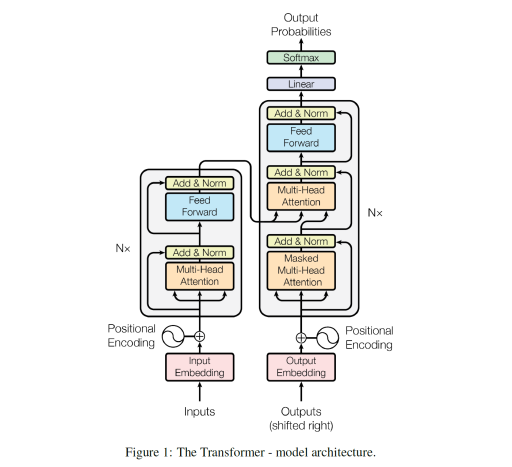
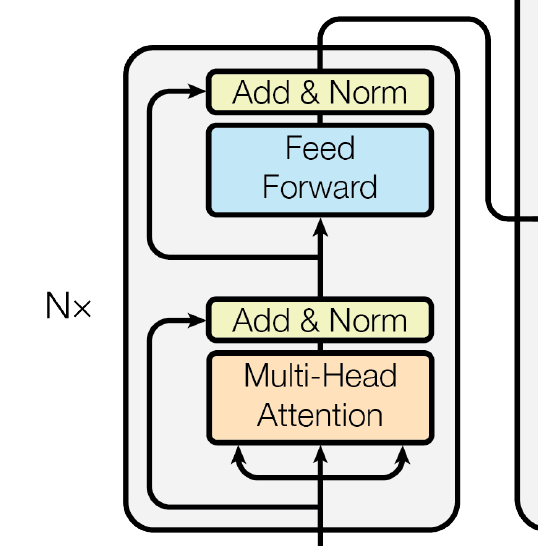
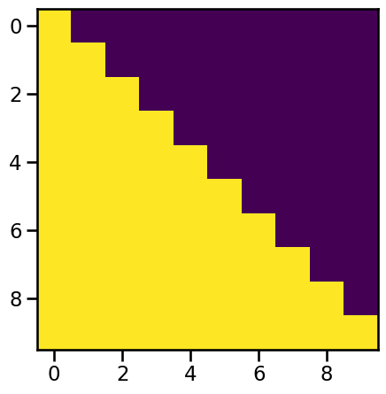
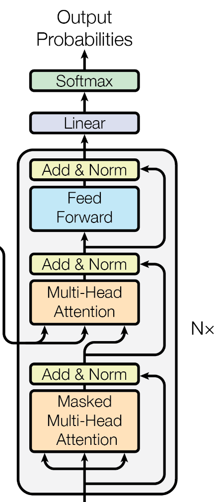
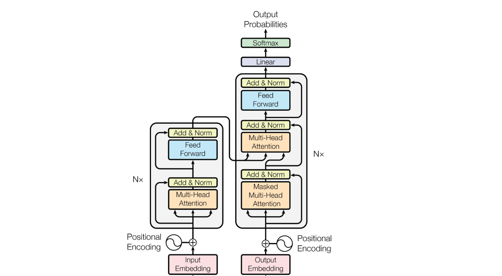

```
"To see a World in a Grain of Sand  And a Heaven in a Wild Flower."
Your Sincerely
Self-Attention
```

Notice: 本文系列分为2篇，核心为本文Ep.1，另有Ep.2处于本文同一分类目录下

全文阅读时间较长，主要借助网络经典材料加以个人思考解读，如有误欢迎斧正

近来浅尝一下Transformer，由于原论文《Attention Is All You Need》[https://arxiv.org/abs/1706.03762](https://arxiv.org/abs/1706.03762) 入手较难，加上PyTorch Doc中Transformer API源代码也不易直接上手（对于我这种小白而言），故找到Harvard NLP的一份注释+上手导读《The Annotated Transformer》[https://nlp.seas.harvard.edu/2018/04/03/attention.html](https://nlp.seas.harvard.edu/2018/04/03/attention.html) 其中代码以PyTorch较为基本的语法思路基本上从0实现Transformer模型整体架构，但对于我这种初学者仍然不甚友好。于是我进行更为详细注解斟酌，供诸位茶余饭后以怡情。

## 整体架构概览

首先，我们找到原论文中对于Transformer模型架构的整体描述与绘图：



整个Transformer模型架构分为左右两侧，分别是编码器(Encoder)和解码器(Decoder)。Transformer模型常用于词语预测/机器翻译任务，当我们喂给模型源文本(source)时，数据的流动方向是：

Source → Embed + PE → Encoder Layers → 特征记忆 (K, V) → 注入特征至 Cross-Attention

Target (右移) → Embed + PE → Masked Self-Attention → 上下文表示 → 预测输出 Out

进一步阐释**数据的2支路流动**：

① 我们手中的原始(source)输入喂给Encoder之后，先通过嵌入层(Embedding)并加入位置编码使独热的词向量转变为稠密的特征向量并有各自的位置编码(PE)（因为各词在句子中位置不同）；随后我们看到这些向量在经过内部两个层部分（之后详说）处理之后最终得到"含义"(Memory)；

② Decoder获得的输入是右移后的Target（即翻译任务/预测任务的正确答案），这些词向量同样会经过Embed+PE；随后我们看到它们却先经过一个掩码多头注意力层部分，然后参考查询从Encoder传来的特征记忆(Memory)得到上下文表示（这里是交叉注意力机制）；最后通过generator得到所有位置上每个词的预测概率值，进而可以选得最优解out。

2%

下面以《The Annotated Transformer》代码为基础进行模型讲解阐释，为内容简要之需，模型内部涉及的各个小板块的详尽讨论将会放至各篇文章中。

## Encoder–Decoder 整体框架

- **整体Encoder-Decoder构架**

```
class EncoderDecoder(nn.Module):
    def __init__(self, encoder, decoder, source_embed, target_embed, generator):
        super(EncoderDecoder, self).__init__()
        self.encoder = encoder  
        self.decoder = decoder   
        self.source_embed = source_embed    
        self.target_embed = target_embed    
        self.generator = generator    #将decoder输出logits（每个词的可能性得分）转变为每个词具体的概率值

    def forward(self, source, target, source_mask, target_mask):
        return self.decode(self.encode(source, source_mask), source_mask, target, target_mask)
    
    def encode(self, source, source_mask):
        return self.encoder(self.source_embed(source), source_mask)
    
    def decode(self, memory, source_mask, target, target_mask):
        return self.decoder(self.target_embed(target), memory, source_mask, target_mask)
```

这是Transformer所采用的EncoderDecoder整体大框架，继承神经网络通用父类nn.Module，其中包含的对象就只有5个（见\_\_init\_\_初始化部分）。  
① forward是模型训练时调用的主函数，其与decode函数返回结果相同，但是起到全局调度作用，在训练时形成准确答案语句的memory用于给decoder同步纠错，测试的时候不断调用forward预测下一个词  
② encode是encoder使用的功能函数，描述encoder工作的全过程，得到的是memory；  
③ decode是decoder使用的功能函数，描述decoder工作的基本全过程，得到的是最终的上下文表示（仅剩最后的线性变换得到logits再进一步将其转换为概率值输出）。

## Generator：线性变换与 Softmax

- 上述架构可以看到少了**最后的两个步骤：线性变换(Linear)得到logits + logits转变为概率值输出(SoftMax)**


这一段在上述EncoderDecoder架构中可以看出是一个generator来实现，现在便定义一个Generator大类并将其实例化便可得到generator

```
class Generator(nn.Module):
    #定义一个linear+SoftMax处理集合的标准父类：
    def __init__(self, d_model, vocab):
        super(Generator, self).__init__()
        self.proj = nn.Linear(d_model, vocab)  #从嵌入层维度（模型内部特征向量维度）到词汇表大小维度的线性投影

    def forward(self, x):  #x是decoder的输出，形状为：(batch_size, seq_Len, d_model)
        return F.log_softmax(self.proj(x), dim=-1)
```

注：由于在起始点所有的source/target都经过嵌入层的维度变换，从起始维度（vocab\_size，即词汇表大小，词汇表中有多少个词独热向量的维度就是多少）变为我们人为设置的超参数维度（d\_model，即在模型内部一直运行的隐层维度），然而最后我们需要得到每个词的概率值，因而最终维度 = vocab\_size，所以需要进行一次**人为线性维度变换d\_model——>vocab\_size**  
最后调用log\_softmax函数对于每一个词的原始得分(logits)处理得到每一个位置处词汇表中**每个单词的概率值大小**，也即是forward函数的返回值  
注：最后一步取log：普通的softmax概率分布通常比较平缓，而log之后，概率小的词会变成绝对值很大的负数，概率大的词接近0（使梯度下降更快，模型更敏感）

## 编码器与层堆叠

随后，将正式分别建构Encoder与Decoder，注原论文中所阐述是："_composed of a stack of N = 6 identical layers_"，即**Encoder与Decoder都分别由6个相同层堆叠而成**。

- "相同层堆叠"涉及层这个类对象的复制与封装，现**先引入克隆函数clone**:

```
def clone(module, N):
    return nn.ModuleList([copy.deepcopy(module) for _ in range(N)])
```

注：必须调用深层拷贝：deepcopy：递归地拷贝对象及其内部所有的子对象，会在内存中完全重新开辟一块空间（保证相互独立！），把原件里的所有内容（包括权重、偏置、结构）复刻一份。

- **构建完整编码器encoder**：

```
class Encoder(nn.Module):
    def __init__(self, layer, N):
        super(Encoder, self).__init__()   #标准的PyTorch初始化，继承父类nn.Module所有属性
        self.layers = clone(layer, N)   #克隆之后要定义的单个EncoderLayer模板
        self.norm = LayerNorm(layer.size)   #实例化了一个LayerNorm（层归一化）组件，其处理维度等于模型的隐层维度layer.size
    
    #说明：调用layer时实际上每一层里面都有norm，最后全部循环结束之后再来一次norm
    def forward(self, x, mask):
        for layer in self.layers:
            x = layer(x, mask)    #Encoder使用的mask是普通去除<PAD>的mask
        return self.norm(x)
```

可以对照一下原论文里面的encoder建构：


刚才我们构建是直接使用 clone(layer, N)，那么现在就是构建这个要被传入的layer类：  
第一个子层包括：多头自注意力层 + 残差连接&层归一化；  
第二个子层包括：前馈网络FFN + 残差连接&层归一化。

我们发现这两个子层中第一步操作不同，但是之后都是会进行残差连接&层归一化，进一步地，我们看到右边的Decoder中这种情况类似，因此，我们可以考虑**把这种"残差连接 & 层归一化"抽象为一种特殊操作，这种特殊操作被施加在其他操作（自注意力、FFN、交叉注意力...）上，进一步将其抽象为一个类。**

注意：原始论文中我们发现层归一化（Norm）和残差连接一起处于上一个操作之后，这称为**post-norm**:

Output\=LayerNorm(x+SubLayer(x))Output = \text{LayerNorm}(x + \text{SubLayer}(x))

但在《The Annotated Transformer》中，则是采用层归一化放在子层之前，残差连接直接作用在原始特征上，这称为**pre-norm**:

Output\=x+SubLayer(LayerNorm(x))Output = x + \text{SubLayer}(\text{LayerNorm}(x))

目前**主流使用pre-norm**，因为在每一层输入之前都预做一次层归一化可以使模型学习更加平稳，梯度不会爆炸。

### 残差连接与层归一化（Pre-Norm）

- 现在我们先把本文中所使用的**pre-norm这个"加工操作"封装成一个类SublayerConnection**：

```
class SublayerConnection(nn.Module):
    def __init__(self, size, dropout):
        super(SublayerConnection, self).__init__()
        self.norm = LayerNorm(size)    #针对d_model的层归一化（size其实就是d_model）
        self.dropout = nn.Dropout(dropout)    #传入的dropout是随机丢弃神经元的比例

    #这个地方的sublayer实质只是一个占位符（后续看来应当是一个计算流程说明书/函数而不是一个具体的计算值），还并没有定义其具体数据类型+含义！
    def forward(self, x, sublayer):
        return x + self.dropout(sublayer(self.norm(x)))    #额外加入dropout也可增强泛化能力
```

流程实现就是： **先归一化——>sublayer进行主操作——>dropout + 残差连接**

- 另外地，对我们所使用到的**层归一化（LayerNorm**）我们单独编写一个类实现其本质操作：

```
class LayerNorm(nn.Module):
    def __init__(self, features, eps = 1e-6):
        super(LayerNorm, self).__init__()
        self.a_2 = nn.Parameter(torch.ones(features))   #缩放因子：nn.Parameter告诉PyTorch这两个参数a_2、b_2不是普通参数而是可优化的模型权重
        self.b_2 = nn.Parameter(torch.zeros(features))   #位移因子
        self.eps = eps    #极小值，防止分母为0导致计算崩溃

    def forward(self, x):
        mean = x.mean(-1, keepdim = True)   #均值
        std = x.std(-1, keepdim = True)   #标准差
        return self.a_2 * (x - mean) / (std + self.eps) + self.b_2
    #(x - mean) / (std + self.eps)：使数据变成了标准的正态分布，并将标准正态分布进行 缩放 + 位移
```

x就是在隐层中传递的数据，形状一般就是（batch\_size, seq\_Len, d\_model），在dim = -1上操作表示在每一个Token特征向量内部求各维度元素均值。而最后一步结合概率论中心极限定理可知其实就是**先使数据变成了标准的正态分布，并将标准正态分布进行"缩放 + 位移"**，而缩放和位移因子都是可学习的。

15%

## 多头缩放点积注意力机制

- 有了单独的"加工操作"类SublayerConnection ，我们进入**最核心的多头缩放点积注意力机制（Multi-Head Scaled Dot-Product Attention）的实现**。

- **多头**缩放点积注意力机制不好直接实现，我们先解决**单头**的，其中**核心的就是负责数学计算的attention函数**

讲个故事引入一下注意力机制：

想象你走进了一个巨大的图书馆，你的目标是："寻找关于'猫的寿命'的信息"，并写一篇报告

①**你发起了查询请求**：当你走进大厅时，你脑子里清晰的那个念头——"猫的寿命是多少？"——这是你发起的查询请求

②**你看到了标签**：图书馆里有成千上万本书。每本书的书脊上都贴着标签（如：动物百科、宠物护理、建筑学）。

③**眼神的停留**：你扫视书架：看到"建筑学"，你的目光一闪而过。看到"宠物护理"，你停顿了一下。看到"猫科动物全书"，你的眼睛放光了

④**你在考虑注意力的分配**：你只有8h就得交一篇报告出来，于是你决定把 **80%**心思放在《猫科动物全书》上，**15%** 放在《宠物护理》上，剩下的 **5%**留给其他可能相关的书。

⑤**管理员的禁令**：管理员过来说："三楼还没开放，你不准看那里的书。"

⑥**你终于翻开了书，疯狂获取信息**：书里记载了关于猫的具体文字、图片、数据，你于是选择性地把一些内容直接抄录下来

⑦**你写完了你的报告**：你把从不同书里摘录的信息组合在一起，写成了一份完整的报告

以上故事其实可以基本反映出注意力机制所做的事情及其涉及到的重要概念：查询请求是查询矩阵**Q**，标签是索引矩阵**K**，眼神的停留是**attention score**，注意力的分配总和加起来必=100%就是**SoftMax**，管理员的禁令勉强算作掩码矩阵**Mask**，书里面的具体内容就是内容值矩阵**V**，最后的报告就是得到的上下文表示矩阵**Contextual Representation**。  
**所以我们目前可以感觉到，Attention机制大体而言其实就是先找相关性（Q、K），再以总和100%（SoftMax）给每份信息（V）分配一个相关性分数（attention score），最后按照这个比例进行进行信息（V）的加权求和，最后融合得到结果**

所谓"**点积**"，实质上就是表明**找"Q"、"K"相关性的时候我们使用的是矩阵点积的方法**，这也一定程度上依赖于我们的数学直觉：**向量之间夹角越小，说明两个向量所代表的单词语义越接近**。由概率论知识，我们总是期望在经过归一化处理后**输入的特征向量总是服从N(0, 1)分布**，因而换句话说，两**个词向量乘积越大，我们就基本认定它俩相关性越大**。

所谓"**缩放**"，在向量点积之后除以（根号下维度），一方面是为了缩小向量点积之后结果的方差；另一方面由于我们在计算"权重"时候是对所有点积结果进行SoftMax，而SoftMax函数对大数值极其不友好，如果输入值很大则会输出几乎为1和0的极端概率，此时SoftMax导数趋近于0，在反向传播时，这会导致梯度消失，模型几乎无法继续学习......

### attention 函数实现

- 当然，以上说法自然是粗糙的，下面给出**缩放点积注意力机制的具体函数实现过程**：

```
def attention(query, key, value, mask = None, dropout = None):
    d_k = query.size(-1)   #推理出d_k大小（键向量维度）
    #得分矩阵scores的计算公式：Q与（K的转置点积）再缩放sqrt(d_k)倍
    scores = torch.matmul(query, key.transpose(-2, -1)) / math.sqrt(d_k)

    if mask is not None:
        #.masked_fill是tensor内置函数，mask是一个由0，1组成的矩阵，当mask==0时就填充元素为-1e9（负十亿代表负无穷），表示强制对该处注意力减为0
        scores =  scores.masked_fill(mask == 0, -1e9)
    #scores的形状是(batch_size, h, seq_Len, seq_Len) (最后两个维度是方阵：注意力机制是每个词与所有词的关联:n*n)

    #dim=-1: 方阵的行：代表当前词，列：代表全句词，设置dim=-1时，Softmax会横向跨越每一列："对于句子里的某一个词，它把自己的注意力总量（100%）分配给全句所有词的比例是多少。"
    prob_attention = F.softmax(scores, dim =-1)
    #注：prob_attention的作用与意义：是一张"权重分配表"，决定了模型在生成每个词的新含义时，应该从周围的词中提取多少信息

    if dropout is not None:
        prob_attention = dropout(prob_attention)
    return torch.matmul(prob_attention, value), prob_attention
```

attention函数的第一个返回值就是**注意力机制的核心产物：Contextual Representation（上下文表示）**（已经提取出来了特征）  
值得注意的是，attention机制也相应的融合了dropout

整个过程可以简洁地使用一个注意力机制公式来表示：（之后可加入dropout）

Attention(Q,K,V)\=softmax(QKTdk)V\text{Attention}(Q, K, V) = \text{softmax}\left(\frac{QK^T}{\sqrt{d_k}}\right)V

### 多头注意力 MultiHeadedAttention

- 有了attention函数（单头），我们进一步便可进入**多头缩放点积注意力机制大类MultiHeadedAttention**的构建：

什么是"多头"？ 其实就是因为模型原本**特征空间维度太大**（比如 d\_model=512），我们将其**拆分成多个较小的子空间**（比如 8 个头，每个头负责 64维），再让每个"头"独立地运行一套刚才我们讲过的缩放点积注意力逻辑，这样可以进行并行运算，最后只需要把各个头算得结果拼接起来就大功告成！（动用一下线性代数矩阵乘法的思考）

```
class MultiHeadedAttention(nn.Module):
    def __init__(self, h, d_model, dropout = 0.1):
        super(MultiHeadedAttention, self).__init__()
        assert d_model % h == 0
        #条件判断：每个头处理的键维度 = 总维度 / 头数量（能够整除）
        self.d_k = d_model // h
        self.h = h   #'头'数量
        #克隆4个线性层：前3个分别用于Q, K, V的线性变换，第4个用于最后concat（拼接）后的投影
        self.linears = clone(nn.Linear(d_model, d_model), 4)
        self.attention = None   #占位声明（权重矩阵后面会得到赋值），此处主要是用于可视化
        self.dropout = nn.Dropout(p = dropout)

    def forward(self, query, key, value, mask = None):
        if mask is not None:
            #如果输入了mask，将其从[batch_size, seq_len, seq_len]变成[batch_size, 1, seq_Len, seq_Len]，增加的维度是让这一个mask能被"广播"应用到所有的h个头上（比如覆盖在4维source矩阵上时与其维度对齐）
            mask = mask.unsqueeze(1)
        batch_size = query.size(0)   #推出随数据而来的batch_size大小值
        
        #作线性变换：d_model——>h * d_k
        #zip()用于将多个可迭代对象中对应的元素打包成一个个元组，此时只把线性层前3个与Q、K、V进行配对打包
        #.view()用于在不改变张量数据内容的前提下，重新调整张量的"形状"（各维度大小），此处为：保持Batch维度不变，在self.h 和 self.d_k把原本d_model切分成"头数"和"每个头的维度"，-1表示对应的seq_Len让模型自动适应不同长度的输入
        #最后的Q、K、V形状为：(batch_size, h, seq_Len, d_k)
        query, key, value = [l(x).view(batch_size, -1, self.h, self.d_k).transpose(1, 2)\
                             for l, x in zip(self.linears, (query, key, value))]
        
        x, self.attention = attention(query, key, value, mask = mask, dropout = self.dropout)   #x是上下文表示(融合了上下文特征的向量)，attention是权重矩阵
        #上一步处理后的x形状为：(batch_size, h, seq_Len, d_k)
        #下一步处理之后的x形状为：(batch_size, seq_len, d_model)
        x = x.transpose(1, 2).contiguous().view(batch_size, -1, self.h * self.d_k)
        #注意：tensor.contigous是一个内存管理函数，返回一个内存排列连续的张量.此处作用是让同一个词的8个头特征在物理地址上挨在一起
        return self.linears[-1](x)
        #返回值形状：(batch_size, seq_len, d_model)
```

### 单层编码器 EncoderLayer

- 有了多头缩放点积注意力机制类的构建完成，结合之前的SubLayerConnection类的构建成功，EncoderLayer（单层）里面的所有子层已被全部实现，现在我们试着**构建完整的单层Encoder**：

```
class EncoderLayer(nn.Module):
    def __init__(self, size, self_attention, feed_forward, dropout):
        super(EncoderLayer, self).__init__()
        self.self_attention = self_attention
        self.feed_forward = feed_forward
        self.sublayer = clone(SublayerConnection(size, dropout), 2) 
        self.size = size      #size实质是d_model，也就是嵌入层Embedding的维度

    def forward(self, x, mask):
        x = self.sublayer[0](x, lambda x: self.self_attention(x, x, x, mask))
        return self.sublayer[1](x, self.feed_forward)
```

注：EncoderLayer中第一个子层实行的是多头自注意力：构建的时候传入(x, x, x, mask)即是把x同时作为Q、K、V，三者相同时表明观察同一个目标，也即是**自注意力**  
sublayer\[0\]和\[1\]都是SublayerConnection的实例化类，在之前其明确要求需要传入2个参数：x与'sublayer'，当时的'sublayer'指的是该子层主操作的一个占位符，而此时传入的是lambda x定义的一个以x为输入的匿名函数，后面是该函数的返回值。因为在SublayerConnection传参的时候需要的sublayer实质上是一个计算流程说明书（并不是一个具体值），所以这一套运算逻辑说明书就封装成一个函数lambda（实质上是多头点积缩放自注意力机制实例）  
  
传入lambda之后，第一层操作：x = x + dropout(self\_attention(x\_norm, x\_norm, x\_norm, mask)) ，也就是**'pre-Norm' + self attention + dropout + residual connection**  
第二层操作：**主操作是后面的那个参数FFN即前馈网络，最后返回的是memory**  
  
对比下图可明确当前进度：



40%

Encoder部分搭建完毕，现在进行Decoder部分的搭建

Decoder基本搭建过程大同小异，底层思路与Encoder差别不大，但观下图，我们发现内部涉及的子层一个是**掩码多头自注意力**，另一个则是**多头交叉注意力**，那么这两个我们需借助刚才定义好的MultiHeadedAttention这个抽象大类进行构建：


## 掩码机制（Mask）

- **MASK**：

在具体构建之前，我们先来思考一下这个"掩码"的与之前我们在Encoder中第一个子层中的那个"普通"的多头自注意力核心区别是什么？**核心修改是什么**？**为什么这里要加上掩码而之前没有**？

我们先来看Encoder里面的那个多头自注意力机制的实现过程，里面有这样一段代码：

```
if mask is not None:
        #.masked_fill是tensor内置函数，mask是一个由0，1组成的矩阵，当mask==0时就填充元素为-1e9（负十亿代表负无穷），表示强制对该处注意力减为0
        scores =  scores.masked_fill(mask == 0, -1e9)
```

这段中的**mask**是什么？为什么mask矩阵与scores矩阵比对，把mask矩阵中所有0存在的位置对应到scores矩阵中然后把相应scores矩阵中的元素强行修改为负无穷？但是mask矩阵中1存在的位置对应到scores矩阵中时则是会保留scores矩阵中的元素原值？

实际上，追根溯源，为了利用 GPU 的并行计算能力，我们不能一条一条地处理句子，而是要把多条句子打包成一个**批次（Batch）**。调用你的几何想象，每一个词向量本来是**"类独热编码"**，经过Embedding层之后被嵌入为高维（d\_model）的特征向量，然后一个句子如果有n个词，那么这个句子就会形成 n × d\_model 形状的矩阵，我们把 N 个不同的句子打包成一个Batch，那么就会堆叠成一个 N × n × d\_model 的长方体，但是由于在同一个Batch里面的那些句子们通常不会长度相等，为了构成这个严谨的长方体，我们只能把空余残缺的地方全部用PAD（一般就是0）填充完成。

值得注意的是，既然**PAD都是用0**，那我们后面是怎么分辨这里的0是填充占位符还是说这个向量这一维真实数据就是0呢？

ANS: 因为**"分辨PAD位置"这个行为我们是在词向量通过Embedding层之前进行的**！上面说到，原始数据是以"类独热编码"形式进行初步编码，实际操作就是：

先对词汇表中每个词都分配一个键值（Key）（相当于构建一个字典）：e.g: {**"\<PAD\>" : 0,** "我" : 1, "爱" : 2，"你" : 3 ......} 这个地方我们就把\<PAD\>占位符（0）和其他词（编码非0）区分开来了！这样类独热编码之后，我们马上就去记录这些\<PAD\>的原始位置，记录方法比较简单，其实就是对于这个矩阵里面每个编码元素值判断是否为0，产生一个逻辑矩阵，类似于：

BATCH\_PADDING\_MASK (4x4)

True

False

False

False

True

True

False

False

True

True

False

False

True

True

True

True

上面这个逻辑矩阵就表示：一个Batch里面有4个句子，第1个句子真实长度为1，第2、3个句子真实长度都为2，第4个句子真实长度就为4，False处就是\<PAD\>符所在的地方。在PyTorch中，True = 1， FALSE = 0，这个**矩阵mask形状就是（batch\_size, seq\_Len）**，seq\_Len是当前序列长度，这个形状跟最开始类独热编码后的词向量编码矩阵完全一样。

在经过Embedding之后，每个位置都会延展出长度为d\_model的一维，原词向量矩阵变为（batch\_size, seq\_Len, d\_model），下面我们考虑如果是h个"头"（head），那么原词向量会按照特征维度空间一分为h，分由h个head分别处理。此时**Q、K形状都是（batch\_size, h, seq\_Len, d\_model/n）**，由于：

Scores\=Q⋅KTdk\text{Scores} = \frac{Q \cdot K^T}{\sqrt{d_k}}

```
scores = torch.matmul(query, key.transpose(-2, -1)) / math.sqrt(d_k)
```

可知：**scores形状为：（batch\_size, h, seq\_Len, seq\_Len）**此时特征维度d\_model已经消失

上面我们已知，**mask形状目前为止还是（batch\_size, seq\_Len）**，要让mask能与scores进行比对并修改scores元素值，就必须让mask形状变得跟scores形状完全一样。在**MultiHeadAttention**里面有这样一行操作：

```
if mask is not None:
            mask = mask.unsqueeze(1)
```

这样**原始的（batch\_size, seq\_Len）的mask被处理为（batch\_size, 1, seq\_Len）**

这意味着在MultiHeadAttention后续中：

```
x, self.attention = attention(query, key, value, mask = mask, dropout = self.dropout)
```

意味着**这里给attention函数传入的mask实际上形状已经被调整为（batch\_size, 1, seq\_Len）**

那么后续在attention函数内部：

```
if mask is not None:
        #.masked_fill是tensor内置函数，mask是一个由0，1组成的矩阵，当mask==0时就填充元素为-1e9（负十亿代表负无穷），表示强制对该处注意力减为0
        scores =  scores.masked_fill(mask == 0, -1e9)
```

这里参与比较的mask利用广播机制形状变为（batch\_size, n, seq\_Len, seq\_Len），于是可以正常进行运算

回到最开始的问题：为什么掩码多头自注意力机制需要"掩码"？事实上，**这里"掩码"与上述的mask并不一样，上述的mask是通用于"普通"和"掩码"多头自注意力机制中的mask**，作用是：

**消除 `\<PAD\>` 的物理干扰**：在深度学习中，Batch 处理要求同一个 Batch 内的所有序列长度一致。为了迁就最长的句子，短句子必须补上无效的 `\<PAD\>` 符号。

①**如果不加 Mask**：`\<PAD\>` 对应的 Embedding 虽然是 0 或随机数，但它依然会参与点积运算，产生一个注意力得分。在 Softmax 之后，这些无效位置会分走真实词汇的权重，导致语义表示被"稀释"。  
②**Mask 的作用**：它在 3D 张量的每一层（Head）和每一个 Query 位置上，精准地定位到那些 `\<PAD\>` 所在的列。通过填充 `-1e9`，它在物理上阻断了信息流向这些无效区域

### 掩码防偷看（Subsequent Mask）

- **进入"掩码"多头自注意力机制中的"掩码"**：

首先我们要明确，Encoder的任务和Decoder是不一样的：  
① Encoder手拿正确答案，它的任务是在正确答案中尽可能找到所有的隐含的词与词之间关系，并生成一份特征含义矩阵作为参考资料；  
② Decoder手上不能直接拿着打开的正确资料，但是在训练时我们采取**Teacher-Forcing**策略，即Decoder在预测第(n+1)个词时，Teacher都会告诉他前n个词的正确答案，如果总共要预测的句子长达N个词，那么我们就用**N个学生同时预测不同位置**，这时分由N个Teacher监督，每个Teacher手上拿的答案是在当前学生预测前Teacher向其展示的前面所有空的正确答案，所有学生**同时进行预测**，并在预测完后比对答案根据各自预测的误差（概率分布间差异）每个人都**对同一套Transformer权重参数进行调整**。

但是，**Decoder（所有学生）不能在预测当前空时事先偷看到这个空的正确答案，正确答案必须总是比Decoder的预测晚一个出现，这就是我们所谓的"掩码"防偷看**。

如果没有掩码防偷看，那么Decoder会直接从内存中提取出正确答案并填上去，这是没有训练意义的，因为在**实际任务中我们只会有Memory和训练好的Decoder帮我们完成未知的任务**。

为了让不同位置的学生在做出预测前只能看到自己应该看的那一部分答案，我们使用掩码机制制造一个target\_mask，由于target是答案标签，我们就用target\_mask遮挡答案（target）的一部分让每个学生不能看到将要预测空处的答案：

不妨，**让第n个学生负责预测第n+1个空，那么我们在第n个学生处应当遮挡第n+1空之后的所有正确答案**，此时利用**上/下三角矩阵**的特性，我们应当仿照mask矩阵制造另一个后序掩码矩阵（subsequent mask）：

```
def subsequent_mask(size):
    attention_shape = (1, size, size)    #这里传入的size实质上是seq_Len

    #np.triu (Triangular Upper)会保留矩阵的上三角部分，其余部分置为0，k=1表明从主对角线向右上方偏移一格开始保留
    #'uint8'是将浮点数转换成8位无符号整型（0和1），节省内存并方便后续逻辑判断
    subsequent_mask = np.triu(np.ones(attention_shape), k=1).astype('uint8')

    #最后把这个numpy矩阵转换为tensor张量类型；
    #最后一步通过判断"是否等于 0"完成了反转：原本是0的地方（我们想看的地方）变成了True，原本是1的地方（未来需要遮住的地方）变成了False
    return torch.from_numpy(subsequent_mask) == 0   #(广播逻辑比对）：当对一个张量使用比较运算符时，它会进行逐元素比对并在tensor每一个数据地方返回True/False
```

上述代码思路较简单，首先我们要知道**subsequent\_mask( )的产物应当与之前的mask一同作用在scores上**，而**scores（batch\_size, h, seq\_Len, seq\_Len）**，attention\_shape定为（1, seq\_Len, seq\_Len）是利用了PyTorch的**广播机制（Broadcasting）**[https://docs.pytorch.org/docs/stable/notes/broadcasting.html](https://docs.pytorch.org/docs/stable/notes/broadcasting.html) 当自后向前遍历两个张量的维度大小时，会把attention\_shape扩充为（1, 1, seq\_Len, seq\_Len），直到与scores进行计算时会表现出（batach\_size, h, seq\_Len, seq\_Len）的性质

由于numpy中数学工具功能性质的限制，我们只有采取一种**反转**的方式进行构造一个下三角表示可见的矩阵：

第一步：

```
subsequent_mask = np.triu(np.ones(attention_shape), k=1).astype('uint8')
```

形成：

\[0111001100010000\]\begin{bmatrix} 0 & 1 & 1 & 1 \\ 0 & 0 & 1 & 1 \\ 0 & 0 & 0 & 1 \\ 0 & 0 & 0 & 0 \end{bmatrix}

第二步：(下面这个矩阵会被返回为张量类型）

```
return torch.from_numpy(subsequent_mask) == 0
```

\[TrueFalseFalseFalseTrueTrueFalseFalseTrueTrueTrueFalseTrueTrueTrueTrue\]\begin{bmatrix} \text{True} & \text{False} & \text{False} & \text{False} \\ \text{True} & \text{True} & \text{False} & \text{False} \\ \text{True} & \text{True} & \text{True} & \text{False} \\ \text{True} & \text{True} & \text{True} & \text{True} \end{bmatrix}

这正是我们需要的处理矩阵！！！观察上面这个**Boolean matrix**，我们发现用它去处理scores最后两维形成的"相关性矩阵"可以达到掩码的目的：第一个同学只能看到第0个起始符BOS来预测第一个空，第二个同学只能看到第0、1位置的答案来预测第二个空......

《The Annotated Transformer》中给我们提供了可视化这个过程的思路：

```
plt.figure(figsize = (5,5))
plt.imshow(subsequent_mask(10)[0])
plt.show()
```

输出为：（`True` (1) 通常显示为黄色/浅色。`False` (0) 通常渲染为紫色/深色）



75%

回归主线，我们现在已经架构好了Encoder；Decoder里面已经把第一个掩码多头缩放点积自注意力层建构完毕，对比下图看下进度：



## 交叉注意力与解码器

- 现在应该向上进入**交叉注意力层**：

所谓交叉注意力，其实如图可以看出来，这是一条Encoder与Decoder融汇的线路，具体来讲就是Decoder在上一层掩码自注意力之后把手上拿到的考题处理了一遍，现在要开始翻阅"参考资料"了，"参考资料"就是Encoder的核心输出，即Memory: （以下来自Encoder大类代码）

```
    def forward(self, x, mask):
        for layer in self.layers:
            x = layer(x, mask)
        return self.norm(x)             #——最后额外一次norm后产出Memory
```

我们回顾一下，之前我们在注意力机制那里引入的"图书馆查阅"故事：写报告前我们是把找到的不同书（即内容值矩阵V）里面的信息按照不同比例融合起来。 自然地，**注意力机制中的V矩阵必须更换为Memory矩阵**；

Attention(Q,K,V)\=softmax(QKTdk)V\text{Attention}(Q, K, V) = \text{softmax}\left(\frac{QK^T}{\sqrt{d_k}}\right)V

但不止于此，**该公式中的K矩阵也必须换为Memory矩阵，因为K包含索引标签**，依靠K才能在Memory中找到相应的语义内容值V（也可理解成"键值对"的关系），**Q只负责查询，查询是由Decoder一方发起的**，因而交叉注意力机制可用以下公式表示：

Cross-Attention(Q,M,M)\=softmax(QMMdk)M\text{Cross-Attention}(Q, M, M) = \text{softmax}\left(\frac{QM^M}{\sqrt{d_k}}\right)M

### 构建 DecoderLayer 与 Decoder

- 由于之前已有现成的attention函数和相应的MultiHeadAttention大类，我们直接借用以**构建DecoderLayer即一个单层的Decoder架构：**

```
class DecoderLayer(nn.Module):
    def __init__(self, size, self_attention, cross_attention, feed_forward, dropout):
        super(DecoderLayer, self).__init__()
        self.size = size    #size实质上就是d_model，之后会用于LayerNorm作参数
        self.self_attention = self_attention
        self.cross_attention = cross_attention
        self.feed_forward = feed_forward
        #克隆3个子层，对应Decoder里面所执行的3个小子层操作
        self.sublayer = clone(SublayerConnection(size, dropout), 3)

    def forward(self, x, memory, source_mask, target_mask):
        m = memory
        
        x = self.sublayer[0](x, lambda x: self.self_attention(x,x,x,target_mask))
        
        x = self.sublayer[1](x, lambda x: self.cross_attention(x,m,m,source_mask))

        return self.sublayer[2](x, self.feed_forward)
```

**第一小子层\[0\]操作：x = x + dropout(self\_attention(norm\_x, norm\_x, norm\_x, target\_mask))  
第二小子层\[1\]操作：交叉注意力把注意力机制中的Q与V都换成memory  
最后\[2\]操作：x = x + dropout(feed\_forward(x))（如果要进入下一层，就在下一层开始的时候进行normalize；如果所有堆叠层全部结束，在Decoder定义结尾（N层堆叠结束后）会再进行一次norm）**

- 进一步**构建Decoder整体：**

```
class Decoder(nn.Module):
    def __init__(self, layer, N):
        super(Decoder, self).__init__()
        self.layers = clone(layer, N)
        self.norm = LayerNorm(layer.size)

    def forward(self, x, memory, source_mask, target_mask):
        for layer in self.layers:
            #注：layer实质包括3个操作：掩码自注意力 + 交叉注意力 + 全连接前馈
            x = layer(x, memory, source_mask, target_mask)
        #6层堆叠结束后最后把结果进行一次归一化
        return self.norm(x)
```

注：Decoder所需参数增加：x是解码器当前生成的句子；memory是编码器最终的输出（交叉注意力所需）；  
target\_mask用于Decoder的自注意力层，防止在训练时解码器偷看下一个答案；source\_mask用于滤去memory中无用的部分（\<PAD\>）

80%

再回顾一下Transformer整体架构，我们发现基本所有框架都已建成，现在只需要再完善实现里面的几个小工具即可



## 收尾组件：Embedding、位置编码与 FFN

- 先实现**最开始的嵌入操作（Embedding）**：

```
class Embeddings(nn.Module):
    def __init__(self, d_model, vocab):
        super(Embeddings, self).__init__()
        self.lut = nn.Embedding(vocab, d_model)
        self.d_model = d_model

    def forward(self, x):
        return self.lut(x) * math.sqrt(self.d_model)
```

虽然PyTorch的API：nn.Embedding可以直接实现嵌入操作，但是为使用方便，仍然选择封装一个特有的Embeddings类。  
lut（Look-Up Table）是一个二维矩阵（Tensor），形状是（vocab\_size，d\_model），其实就是嵌入的主操作（改变维度），里面每一行对应字典里的一个单词（索引）；每一列是一个特征维度，是浮点数，所以说**lut里面就装载着所有单词对应的特征向量**。  
**我们会建立单词表（单词对应各个索引值），此时x就是输入的一连串索引，执行forward时就将索引转换为对应嵌入后的特征向量**  

封装独特的Embeddings类最大的原因是：由于词向量嵌入之后会立即被位置编码（加上位置编码值，在0，1之间），所以**在forward函数中对特征向量各维度数值通过放大一定倍数（根号下d\_model）以保护语义**

### 位置编码 Positional Encoding

- 实现Positional Encoding（PE）位置编码：

与RNN利用时间轴先后顺序区别不同词语不同，Transformer由于用到巨大的并行计算需要给每个词向量加上相应的位置向量进行编码。

1. 假如说用1，2，3......依次进行每一个词的位置编码怎样？
    - 不行：位置编码值太大！  
        

3. 用(0,1)内浮点数编码如何？
    - 不行：受句子长短影响大，同一个浮点数在不同长度句子里面表示的位置完全不同、

论文中成功的思路：用不同频率的三角函数编码（有点类似于傅里叶变换（Fourier Transformation））  
**在FT中我们使用交替的正余弦函数，且频率递增作为一组基，把时域信号拆分为频域信号；  
在PE中我们则是进行相反的事情，把频域信号拆分为时域信号** （笔者此处不是太清楚，还未完全理解）

- 按照论文所示公式，**位置编码大类构建**如下：

```
class PositionalEncoding(nn.Module):
    def __init__(self, d_model, dropout, max_Len = 5000):
        super(PositionalEncoding, self).__init__()
        self.dropout = nn.Dropout(p = dropout)
        
        #先初始化一个max_Len * d_model大小的全零矩阵
        pe = torch.zeros(max_Len, d_model)
        #生成列向量：[0, 1, ..., 4999]
        position = torch.arange(0, max_Len).unsqueeze(1)
        #这是公式里面的分母：10000^(2i/d_model)
        #语法步骤：首先生成：[0, 2,......, d_model-2]，然后后面是把指数写成取对后的结果 （* - 意思是乘上负数）
        div_term = torch.exp(torch.arange(0, d_model, 2) * - (math.log(10000.0) / d_model))

        #切片进行奇偶位置分别赋值  
        pe[:, 0::2] = torch.sin(position * div_term)       
        pe[:, 1::2] = torch.cos(position * div_term)
        pe = pe.unsqueeze(0)
        self.register_buffer('pe', pe)

    
    def forward(self, x):
        #x.size(1)：获取当前句子的长度（用对应当前总词数的位置编码母矩阵的切片进行叠加）
        x = x + Variable(self.pe[:, :x.size(1)], requires_grad = False)   #Variable封装成一个不需要求导的变量，不需梯度下降进行优化
        return self.dropout(x)   #加上位置编码之后再dropout
    
```

笔者之前做过一份关于位置编码的例子如下阐释

#### 位置编码示例（Demo）

① 使用 sin/cos 以固定表征（位置编码始终固定）

② pe(pos + k) 可以写成 pe(pos) 的线性组合（序列长度推广）

③ 通过残差连接使位置信息流入深层

**Demo:** 假设完整的词嵌入矩阵（look-up table）为 30000 × 512 (vocab\_size × d\_model)，我们目标语句只有里面的三个词，那么在实际构建 Input 时我们将这三个词在 look-up table 中的稠密向量抽取出来，构成一个 3 × 512 的矩阵。位置编码矩阵在模型初始化时，通常会预先算好一个很大的"母矩阵"（比如 5000 × 512），代表这个模型最长能处理 5000 个词，由于我们现在要处理的句子只有 3 个词，模型就会从母矩阵里切下前 3 行得到一个 3 × 512 的"切片"，让切片和同样是 3 × 512 的词嵌入矩阵相加。

|  | **维 0** (sin) | **维 1** (cos) | **维 2** (sin) | **维 3** (cos) |
| --- | --- | --- | --- | --- |
| **位置 0** | sin(0)   0 | cos(0)   1 | sin(0)   0 | cos(0)   1 |
| **位置 1** | sin(1/1)   0.841 | cos(1/1)   0.540 | sin(1/10)   0.100 | cos(1/10)   0.995 |
| **位置 2** | sin(2/1)   0.909 | cos(2/1)   -0.416 | sin(2/10)   0.199 | cos(2/10)   0.980 |

PE =

0,     1,     0,     1  
0.841, 0.540, 0.100, 0.995  
0.909, -0.416, 0.199, 0.980

### 前馈网络 FFN

- 最后我们还得来**实现FFN**：

FFN全称可以叫它 Point-Wise Feed-Forward Network，事实上就是**它是由两个全连接线性层组成的模块，中间夹着一个非线性激活函数**，做的工作也是最为基础的"线性变换——非线性激活——线性变换"。

无论是在Encoder还是Decoder中，我们看到FFN都是处于一个基本层的最后一步操作，其操作与在它之前的注意力机制不同点在于**注意力机制着重于寻找不同词之间的语义关系，而FFN着重于寻找一个词不同维度之间的关系**，而这样一种"**先'空间混合'（Spatial Mixing）后'通道变换'（Channel Transformation）**"是一种科学的神经网络架构。 （这种设计的科学性证明目前笔者还未查证）

既然内部组成就是**两个全连接线性层组成的模块，中间夹着一个非线性激活函数**，那我们直接实现：

```
class PositionWiseFFN(nn.Module):
    def __init__(self, d_model, d_ff, dropout=0.1):
        super(PositionWiseFFN, self).__init__()
        self.w_1 = nn.Linear(d_model, d_ff)                                                                                                                                                                                                                                                                                                                                        
        self.w_2 = nn.Linear(d_ff, d_model)
        self.dropout = nn.Dropout(dropout)

    def forward(self, x):
        return self.w_2(self.dropout(F.relu(self.w_1(x))))
```

从最后return一步可以看出来操作的全流程：  
**先线性变换w\_1，再ReLU激活，再dropout，最后一次线性变换w\_2**

截止目前，我们已经完成了Transformer模型结构的完整构建！！！

## 组装完整模型

- **最后一步：使用我们之前的那些抽象类生成完整模型**（自己还要设置模型中的超参数）

```
def make_model(source_vocab, target_vocab, N = 6, d_model = 512, d_ff = 2048, h = 8, dropout = 0.1):
    #用输入的超参数建立模型
    c = copy.deepcopy
    attention = MultiHeadedAttention(h, d_model)
    ffn = PositionWiseFFN(d_model, d_ff, dropout)
    position = PositionalEncoding(d_model, dropout)

    model = EncoderDecoder(
        Encoder(EncoderLayer(d_model, c(attention), c(ffn), dropout), N),
        Decoder(DecoderLayer(d_model, c(attention), c(attention), c(ffn), dropout), N),
        
        nn.Sequential(Embeddings(d_model, source_vocab), c(position)),
        nn.Sequential(Embeddings(d_model, target_vocab), c(position)),
        Generator(d_model, target_vocab)
    )

    for p in model.parameters():
        if p.dim() > 1:
            nn.init.xavier_uniform(p)

    return model
```

核心部分就在于model = { }一段，里面描述了整个Transformer模型的结构，我们回顾一下EncoderDecoder大框架中确定下来的传参：

```
class EncoderDecoder(nn.Module):
    def __init__(self, encoder, decoder, source_embed, target_embed, generator):
```

**在这里我们传入source\_embed和target\_embed时实际上是把要做的两种操作：embed + PE 用nn.Sequential打了个包做成一个容器，这样当调用这个容器时，输入数据会先进入第一个模块（`Embeddings`），其输出会自动变成第二个模块（`位置编码`）的输入。**

99.9%

## 结语

大功告成了吗？并没有.......

我们现在只是实现了Transformer的底层架构，但是当处理实际例子时会发现还有处理数据、迭代训练......各种操作以及其他的优化技巧、损失器.......模型训练一系列必备操作等着我们

在《The Annotated Transformer》中作者基本1：1复现论文中的所有内容，包括后面的多GPU训练、各种组件......考虑时间设备精力有限，笔者也是初步入门，故主要学习后面的一个简单的Copy Task实现，在下一篇文章Ep.2中逐渐完善

本文除代码学习《The Annotated Transformer》，论文解读《Attention Is All You Need》之外其余解读均出自笔者手，如有错误之处欢迎指正