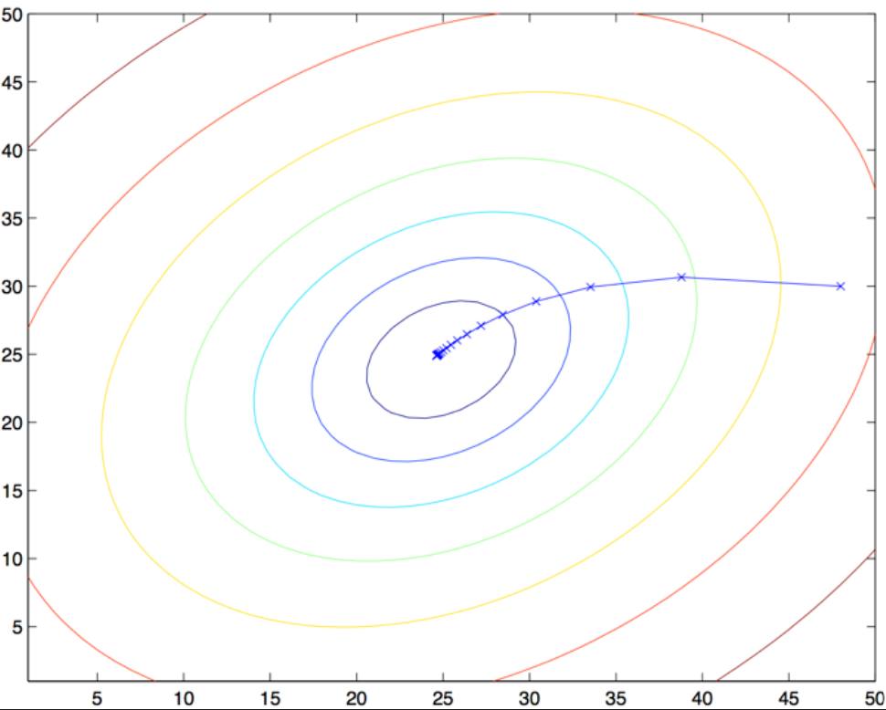

> **TL;DR**:
> - **监督学习**：给定训练样本 $(x, y)$，学出 hypothesis $h(x)$ 来预测
> - **梯度下降求 $\theta$**：LMS（单样本）、Batch GD（全样本求和）、SGD（逐样本）三种更新规则；线性回归只有全局最优（不会陷入局部最优）
> - **正规方程**：$\theta = (X^T X)^{-1} X^T y$，闭式解，照应最小二乘
> - **概率视角**：误差 $\varepsilon \sim \mathcal{N}(0, \sigma^2)$ （高斯分布）+ 最大似然 $\Rightarrow$ 最小二乘 $J(\theta)$
> - **局部加权线性回归 (LWR)**：非参数方法，权值 $w^{(i)} = \exp\!\left(-\frac{(x^{(i)} - x)^T(x^{(i)} - x)}{2\tau^2}\right)$，查询点附近样本影响最大

## 引子

CS229 正式上课的第一节，我们从监督学习（supervised learning）家族里最简单的成员——**线性回归**（linear regression）入手，逐步把它和**梯度下降**（gradient descent）、**正规方程**（normal equation）、以及一个最小二乘的**概率解释**串起来，最后介绍一种"非参数"的扩展：**局部加权线性回归**（locally weighted linear regression, LWR）。

## 1. 记号与假设

在开始之前，先把后面会反复用到的符号列清楚：

- $\theta$：参数
- $m$：输入样本数（即表格的行数）
- $x$：输入 / 特征
- $y$：输出 / 目标变量
- $(x, y)$：一个训练样本
- $(x^{(i)}, y^{(i)})$：第 $i$ 个训练样本

**Hypothesis**（假设函数）：

$$
h_\theta(x) = \theta_0 + \theta_1 x_1 + \theta_2 x_2 + \dots + \theta_n x_n
$$

$$
h(x) = \sum_{i=0}^n \theta_i x_i = \theta^T x
$$

> **目标**：选取 $\theta$，使得 hypothesis $h$ 在训练集上预测得最准。

**最小化代价函数**：

$$
J(\theta) = \frac{1}{2} \sum_{i=1}^m \left( h_\theta(x^{(i)}) - y^{(i)} \right)^2
$$

> **p.s**：线性回归是回归家族中的一个特例，平方误差（squared error）恰好对应高斯噪声——这一点在第 4 节会从概率角度重新推导出来。

## 2. 梯度下降

从一个 $\theta$ 的初始猜测（通常是全零向量 $\vec{0}$）出发，沿着 $J(\theta)$ 的负梯度方向不断更新 $\theta$，试图让 $J(\theta)$ 越来越小。

> 当我们在线性回归上跑梯度下降时，**没有局部最优问题**——$J(\theta)$ 是凸二次函数，只有一个全局最小。

### 2.1 LMS 更新规则

LMS（Least Mean Squares）算法的更新公式：

$$
\theta_j := \theta_j - \alpha \, \frac{\partial J(\theta)}{\partial \theta_j}, \quad j = 0, 1, \dots, n
$$

其中：

- $\alpha$：学习率（learning rate）
- $:=$：赋值符号（编程里的 lvalue 被修改）

下面把 $J(\theta)$ 的偏导数展开：

$$
\begin{aligned}
\frac{\partial}{\partial \theta_j} J(\theta)
&= \frac{\partial}{\partial \theta_j} \, \frac{1}{2} \sum_{i=1}^m \left( h_\theta(x^{(i)}) - y^{(i)} \right)^2 \\
&= \left( h_\theta(x^{(i)}) - y^{(i)} \right) \cdot \frac{\partial}{\partial \theta_j} \left( h_\theta(x) - y \right) \\
&= \left( h_\theta(x) - y \right) \cdot \frac{\partial}{\partial \theta_j} \left( \sum_{i=0}^n \theta_i x_i - y \right) \\
&= \left( h_\theta(x) - y \right) x_j
\end{aligned}
$$

于是**对单个训练样本**的更新就是：

$$
\theta_j := \theta_j + \alpha \left( h_\theta(x^{(i)}) - y^{(i)} \right) x_j^{(i)}
$$

由于"和的导数等于导数的和"，对所有训练样本求和后得到的更新是（这叫 **batch gradient descent**——每次更新都遍历整个训练集）：

$$
\theta_j := \theta_j + \alpha \sum_{i=1}^m \left( h_\theta(x^{(i)}) - y^{(i)} \right) x_j^{(i)}
$$

其中 $j = 0, 1, \dots, n$，重复此过程直到收敛。

> 通常学习率 $\alpha$ 要在指数尺度上尝试几次，才能挑出合适的值。

**这条更新规则的直观含义**：

- 更新幅度正比于 $(h_\theta(x^{(i)}) - y^{(i)})$：预测越准，更新越小；预测越偏，更新越大
- 也就是说，当某个训练样本已经预测得很准时，参数几乎不需要再动；反之，预测偏差大的样本会触发更大的调整



### 2.2 批量 vs 随机梯度下降

**Batch Gradient Descent**

- 每一步都用**所有** $m$ 个训练样本求和
- 缺点：当 $m$ 很大时，每次更新都要做一次大求和，速度很慢

**Stochastic Gradient Descent (SGD)**

```
Repeat:
    for i = 1 to m:
        for every j:
            θⱼ := θⱼ + α ( h_θ(x⁽ⁱ⁾) - y⁽ⁱ⁾) xⱼ⁽ⁱ⁾
```

> 换句话说，SGD **每次只用单个当前样本**就把整个 $\theta$ 更新一遍。

SGD 通常比 Batch GD **更快地到达一个足够接近最小值的 $\theta$**（注意它可能不会完全收敛到最小值——$\theta$ 会在 $J(\theta)$ 的最小值附近震荡；但实践中这些近似值已经足够精确，可以直接用）。正因为如此，**当训练集很大时，SGD 通常比 Batch GD 更受青睐**。

> 最常见的做法是：先确定一个具体的 $\alpha$（配合数据集规模挑选），然后在 SGD 跑的过程中让 $\alpha$ **逐步衰减到 0**。这样最终得到的参数会真正收敛到最小值，而不是一直在附近震荡。

## 3. 正规方程

注意正规方程只适用于线性回归。

**预备知识**（用上一节线性代数数学基础回顾里的几条Marix Calculus公式）：

$$
\nabla_A \operatorname{tr}(AB) = B^T
$$
$$
\nabla_{A^T} f(A) = (\nabla_A f(A))^T
$$
$$
\nabla_A \operatorname{tr}(A B A^T C) = C A B + C^T A B^T
$$
$$
\nabla_A |A| = |A| (A^{-1})^T
$$

（注意上面式子里的 $A$ 必须是非奇异方阵）

现在，给定一个数据集，先把所有训练样本的输入值按行堆起来，得到**设计矩阵** $X \in \mathbb{R}^{m \times (n+1)}$（如果考虑截距项 $\theta_0$ 就是 $m \times (n+1)$ 矩阵）：

$$
X = \begin{bmatrix}
-(x^{(1)})^T- \\
-(x^{(2)})^T- \\
\vdots \\
-(x^{(m)})^T-
\end{bmatrix}
$$

对应的目标向量 $y \in \mathbb{R}^m$：

$$
y = \begin{bmatrix}
y^{(1)} \\
y^{(2)} \\
\vdots \\
y^{(m)}
\end{bmatrix}
$$

参数向量 $\theta \in \mathbb{R}^{n+1}$：

$$
\theta = \begin{bmatrix}
\theta_0 \\
\theta_1 \\
\vdots \\
\theta_n
\end{bmatrix}
$$

由 $h_\theta(x^{(i)}) = (x^{(i)})^T \theta$ 得：

$$
X \theta - y = \begin{bmatrix}
(x^{(1)})^T \theta \\
\vdots \\
(x^{(m)})^T \theta
\end{bmatrix}
- \begin{bmatrix}
y^{(1)} \\
\vdots \\
y^{(m)}
\end{bmatrix}
= \begin{bmatrix}
h_\theta(x^{(1)}) - y^{(1)} \\
\vdots \\
h_\theta(x^{(m)}) - y^{(m)}
\end{bmatrix}
$$

代价函数（Cost function）（注意这里用的是向量范数平方形式）：

$$
J(\theta) = \frac{1}{2} (X \theta - y)^T (X \theta - y)
$$

> 用线性代数回顾里给出的求导工具，可以直接对 $J(\theta)$ 求梯度：

$$
\begin{aligned}
\nabla_\theta J(\theta)
&= \nabla_\theta \left[ \frac{1}{2} (X \theta - y)^T (X \theta - y) \right] \\
&= \frac{1}{2} \nabla_\theta \left[ \theta^T X^T X \theta - \theta^T X^T y - y^T X \theta + y^T y \right] \\
&= \frac{1}{2} \nabla_\theta \operatorname{tr}\!\left( \theta^T X^T X \theta - \theta^T X^T y - y^T X \theta + y^T y \right) \\
&= \frac{1}{2} \nabla_\theta \left( \operatorname{tr}(\theta^T X^T X \theta) - 2 \operatorname{tr}(y^T X \theta) \right) \\
&= \frac{1}{2} \left( X^T X \theta + X^T X \theta - 2 X^T y \right) \\
&= X^T X \theta - X^T y
\end{aligned}
$$

令梯度为零（因为我们要最小化代价函数！），就得到**正规方程**：

$$
X^T X \, \theta = X^T y
$$

因此解出：

$$
\boxed{\theta = (X^T X)^{-1} X^T y}
$$

## 4. 概率解释

面对一个回归问题，为什么最小二乘代价函数 $J$ 是一个合理的选择？这一节给一组概率假设，在这些假设下，最小二乘回归会被自然地推导出来。

**假设**：

$$
y^{(i)} = \theta^T x^{(i)} + \varepsilon^{(i)}
$$

其中 $\varepsilon^{(i)}$ 是一个误差项，捕捉了未建模的影响或随机噪声。

进一步假设 $\varepsilon^{(i)}$ **独立同分布**（IID）地服从均值为 0、方差为 $\sigma^2$ 的高斯分布：

$$
\varepsilon^{(i)} \sim \mathcal{N}(0, \sigma^2)
$$

$\varepsilon^{(i)}$ 的密度函数：

$$
p(\varepsilon^{(i)}) = \frac{1}{\sqrt{2\pi}\sigma} \exp\!\left( - \frac{(\varepsilon^{(i)})^2}{2\sigma^2} \right)
$$

由 $y^{(i)} = \theta^T x^{(i)} + \varepsilon^{(i)}$ 得到：

$$
\varepsilon^{(i)} = \theta^T x^{(i)} - y^{(i)}
$$

把它代入上面的密度函数（也就是高斯分布密度函数里面指数项的分子代入）：

$$
p(\varepsilon^{(i)} \mid x^{(i)}; \theta) = \frac{1}{\sqrt{2\pi}\sigma} \exp\!\left( - \frac{\left(y^{(i)} - \theta^T x^{(i)}\right)^2}{2\sigma^2} \right)
$$

由概率论中随机变量替换关系 $p_Y(y) = p_\varepsilon(\varepsilon) \cdot \left|\frac{dy}{d\varepsilon}\right|$，并且 $\frac{dy}{d\varepsilon} = 1$，直接把 $\varepsilon$ 和 $p(\varepsilon)$ 换成 $y$ 和 $p(y)$：

$$
p(y^{(i)} \mid x^{(i)}; \theta) = \frac{1}{\sqrt{2\pi}\sigma} \exp\!\left( - \frac{\left(y^{(i)} - \theta^T x^{(i)}\right)^2}{2\sigma^2} \right)
$$

> 记号 $p(y^{(i)} \mid x^{(i)}; \theta)$ 表示：在给定 $x^{(i)}$ 的条件下，$y^{(i)}$ 的分布由 $\theta$ 参数化。这里**不能**写成 $p(y^{(i)} \mid x^{(i)}, \theta)$，因为 $\theta$ 不是随机变量。

$y^{(i)}$ 的分布还可以写成：

$$
y^{(i)} \mid x^{(i)}; \theta \sim \mathcal{N}\!\left( \theta^T x^{(i)}, \sigma^2 \right)
$$

现在我们有 $m$ 个样本。由于假设误差 $\varepsilon^{(i)}$ 是 IID 的，所有样本的联合概率就是各自概率的乘积，称为**似然函数**（likelihood）——这已经是一个关于 $\theta$ 的函数了（注：我们刚才说的条件概率中 $\theta$ 是一个已知量，但现在是函数的自变量！）：

$$
L(\theta) = \prod_{i=1}^m p\!\left( y^{(i)} \mid x^{(i)}; \theta \right)
$$

给定 $(x^{(i)}, y^{(i)})$ 之间的概率模型，怎么选 $\theta$ 的最佳猜测？**最大似然法**告诉我们：要选那个让似然函数 $L(\theta)$ 尽可能大的 $\theta$。

对刚才的似然函数取对数可以把连乘变成连加，得到**对数似然函数** $\ell(\theta)$：

$$
\begin{aligned}
\ell(\theta)
&= \log L(\theta) \\
&= \sum_{i=1}^m \log \left[ \frac{1}{\sqrt{2\pi}\sigma} \exp\!\left( - \frac{\left(y^{(i)} - \theta^T x^{(i)}\right)^2}{2\sigma^2} \right) \right] \\
&= \sum_{i=1}^m \left[ \log \frac{1}{\sqrt{2\pi}\sigma} - \frac{\left(y^{(i)} - \theta^T x^{(i)}\right)^2}{2\sigma^2} \right] \\
&= m \log \frac{1}{\sqrt{2\pi}\sigma} - \frac{1}{2\sigma^2} \sum_{i=1}^m \left( y^{(i)} - \theta^T x^{(i)} \right)^2
\end{aligned}
$$

因此，对 $\ell(\theta)$ 取最大值等价于对下式取最小值：

$$
\frac{1}{2} \sum_{i=1}^m \left( y^{(i)} - \theta^T x^{(i)} \right)^2
$$

> 正好就是原始的最小二乘代价函数 $J(\theta)$！这也正说明了为什么最小二乘中的代价函数要使用误差的平方和作为代价！实质就是跟随机误差的高斯分布假设以及高斯分布密度函数的形式特点有关！

## 5. 局部加权线性回归（LWR）

### 5.1 普通线性回归的问题

原始的线性回归算法里，要对一个查询点 $x$ 做预测（比如要计算 $h(x)$），步骤是：

1. 用最小二乘法拟合参数 $\theta$，让训练集所有样本的拟合误差平方和最小：
   $$
   \sum_i \left( y^{(i)} - \theta^T x^{(i)} \right)^2
   $$
2. 输出 $\theta^T x$

可以看出，最小二乘法对**所有样本一视同仁**——每个样本对 $\theta$ 的影响力都是相同的。

### 5.2 LWR 的做法

在 LWR 里，步骤变成：

1. 用参数 $\theta$ 拟合，但用**加权距离**作为目标：
   $$
   \sum_i w^{(i)} \left( y^{(i)} - \theta^T x^{(i)} \right)^2
   $$
2. 输出 $\theta^T x$

其中 $w^{(i)}$ 是非负权值。直观地说：

- 如果某个 $i$ 的 $w^{(i)}$ 很大，那么在选 $\theta$ 时就要**特别照顾**让 $(y^{(i)} - \theta^T x^{(i)})^2$ 这个误差值尽量小
- 如果 $w^{(i)}$ 很小，那么这一项就基本被忽略

> 也就是说，**权值越大的样本，误差被放大得越厉害，对 $\theta$ 的影响也就越大**。

### 5.3 权值的选取

最常用的权值公式：

$$
w^{(i)} = \exp\!\left( - \frac{\left( x^{(i)} - x \right)^2}{2\tau^2} \right)
$$

其中：

- $x$ 是当前查询点
- $\tau$ 是**带宽参数**（bandwidth parameter），控制衰减速度

直观含义：

① 当 $x^{(i)}$ 离查询点 $x$ 很近：$(x^{(i)} - x)^2 \to 0$，分子为 0，$\exp(0) = 1$，权重最大。

② 当 $x^{(i)}$ 离查询点 $x$ 很远：$(x^{(i)} - x)^2 \to \infty$，指数函数趋近于 0，权重几乎为零。

如果 $x$ 是向量，距离就用**欧几里得距离** （Euclidean distance）平方的泛化形式：

$$
w^{(i)} = \exp\!\left( - \frac{\left( x^{(i)} - x \right)^T \left( x^{(i)} - x \right)}{2\tau^2} \right)
$$

如果允许向量的不同维度有不同的伸缩尺度，可以引入**马氏距离**（Mahalanobis distance）：

$$
w^{(i)} = \exp\!\left( - \frac{\left( x^{(i)} - x \right)^T \Sigma^{-1} \left( x^{(i)} - x \right)}{2} \right)
$$

> 所以，$\theta$ 的选择过程会**自动偏向查询点 $x$ 附近的训练样本**。注意权值公式的形状像高斯密度，但它和高斯分布并没有直接关系——只是借了高斯函数的"钟形"衰减特性来给距离"打分"。

### 5.4 参数 vs 非参数

最后值得强调的是两种学习算法的本质区别：

① **无权重线性回归**是**参数学习算法**（parametric learning algorithm）：参数 $\theta_i$ 的个数是固定的、有限的。一旦拟合出 $\theta_i$，就可以扔掉训练数据，不再需要它们做预测。

② **局部加权线性回归**是**非参数学习算法**（non-parametric learning algorithm）：必须**一直保留整个训练集**——因为每来一个新的查询点 $x$，权值 $w^{(i)}$ 都要重算，最优 $\theta$ 也会随之改变。

> "非参数"粗略地指："模型的复杂度和参数数量，会随着训练集规模 $m$ 的增大而线性增大。"

## 参考资料

- [CS229 Lecture Notes 1](https://cs229.stanford.edu/notes2021fall/cs229-notes1.pdf) — 原始讲义，本文知识点的出处
- [CS229 Lecture 1 (Autumn 2018) — Linear Regression and Gradient Descent](https://www.bilibili.com/video/BV1b4anzMEUv) — B站上Andrew Ng 吴恩达老师的讲课视频（Lecture 1），本文同样覆盖里面的讲课时的重要知识点
- [The Matrix Cookbook](https://www.math.uwaterloo.ca/~hwolkowi/matrixcookbook.pdf) — 矩阵恒等式、矩阵微积分速查表，本文第 3 节涉及的所有公式都能在里面找到
- [LWR——Locally Weighted Regression](https://www.cs.cmu.edu/afs/cs/project/jair/pub/volume4/cohn96a-html/node7.html)讲解LWR（局部加权回归算法）的第一手资料，拓展阅读