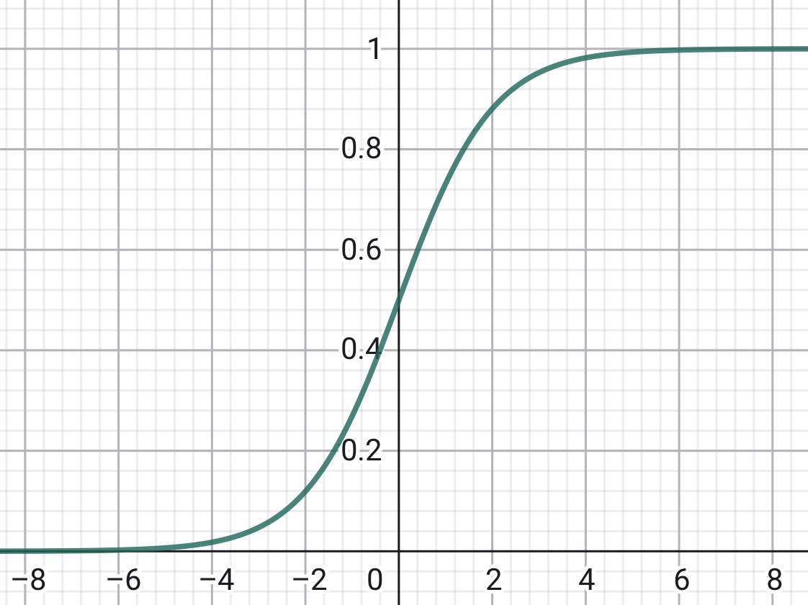

> **TL;DR**:
> - **LWR（局部加权线性回归）**：给样本按距离查询点的远近加权重，距离越近的样本影响越大；是一种**非参数**学习算法（必须保留全部训练数据）
> - **分类问题**：$y \in \{0, 1\}$，用线性回归不合适——预测值会跑出 $[0, 1]$ 区间
> - **Logistic 回归**：把线性输出经过 sigmoid 函数 $g(z) = \frac{1}{1+e^{-z}}$ 压到 $(0,1)$，再用最大似然估计 $\theta$
> - **梯度上升 / Newton's method**：$\ell(\theta)$ 是凹函数，无局部最优；Newton 法收敛快（二次收敛），要用到 Hessian 矩阵的逆

## 引子

Lec 1 里我们处理的是**回归问题**（$y$ 是连续值），用最小二乘 + 梯度下降 / 正规方程来求最优的参数 $\theta$ 值。这一节先补一个 Lec 1 没展开的方法——LWR（局部加权线性回归），然后转入**分类问题**（$y \in \{0, 1\}$），引出 Logistic 回归与 Newton's method。

## 1. 局部加权线性回归（LWR）

### 1.1 普通线性回归的问题

原始的线性回归算法里，要对一个查询点 $x$ 做预测（比如要计算 $h(x)$），步骤是：

1. 用最小二乘法拟合参数 $\theta$，让训练集所有样本的拟合误差平方和最小：
   $$
   \sum_i \left( y^{(i)} - \theta^T x^{(i)} \right)^2
   $$
2. 输出 $\theta^T x$

可以看出，最小二乘法对**所有样本一视同仁**——每个样本对 $\theta$ 的影响力都是相同的。

### 1.2 LWR 的做法

在 LWR 里，步骤变成：

1. 用参数 $\theta$ 拟合，但用**加权距离**作为目标：
   $$
   \sum_i w^{(i)} \left( y^{(i)} - \theta^T x^{(i)} \right)^2
   $$
2. 输出 $\theta^T x$

其中 $w^{(i)}$ 是非负权值。直观地说：

- 如果某个 $i$ 的 $w^{(i)}$ 很大，那么在选 $\theta$ 时就要**特别照顾**让 $(y^{(i)} - \theta^T x^{(i)})^2$ 这个误差值尽量小
- 如果 $w^{(i)}$ 很小，那么这一项就基本被忽略

> 也就是说，**权值越大的样本，误差被放大得越厉害，对 $\theta$ 的影响也就越大**。

### 1.3 权值的选取

最常用的权值公式：

$$
w^{(i)} = \exp\!\left( - \frac{\left( x^{(i)} - x \right)^2}{2\tau^2} \right)
$$

其中：

- $x$ 是当前查询点
- $\tau$ 是**带宽参数**（bandwidth parameter），控制衰减速度

直观含义：

① 当 $x^{(i)}$ 离查询点 $x$ 很近：$(x^{(i)} - x)^2 \to 0$，分子为 0，$\exp(0) = 1$，权重最大。

② 当 $x^{(i)}$ 离查询点 $x$ 很远：$(x^{(i)} - x)^2 \to \infty$，指数函数趋近于 0，权重几乎为零。

如果 $x$ 是向量，距离就用**欧几里得距离** （Euclidean distance）平方的泛化形式：

$$
w^{(i)} = \exp\!\left( - \frac{\left( x^{(i)} - x \right)^T \left( x^{(i)} - x \right)}{2\tau^2} \right)
$$

如果允许向量的不同维度有不同的伸缩尺度，可以引入**马氏距离**（Mahalanobis distance）：

$$
w^{(i)} = \exp\!\left( - \frac{\left( x^{(i)} - x \right)^T \Sigma^{-1} \left( x^{(i)} - x \right)}{2} \right)
$$

> 所以，$\theta$ 的选择过程会**自动偏向查询点 $x$ 附近的训练样本**。注意权值公式的形状像高斯密度，但它和高斯分布并没有直接联系——只是借了高斯函数的"钟形"衰减特性来给距离"打分"。

### 1.4 参数 vs 非参数

最后值得强调的是两种学习算法的本质区别：

① **无权重线性回归**是**参数学习算法**（parametric learning algorithm）：参数 $\theta_i$ 的个数是固定的、有限的。一旦拟合出 $\theta_i$，就可以扔掉训练数据，不再需要它们做预测。

② **局部加权线性回归**是**非参数学习算法**（non-parametric learning algorithm）：必须**一直保留整个训练集**——因为每来一个新的查询点 $x$，权值 $w^{(i)}$ 都要重算，最优 $\theta$ 也会随之改变。

> "非参数"粗略地指："模型的复杂度和参数数量，会随着训练集规模 $m$ 的增大而线性增大。"

---

## 2. 分类问题与 Logistic 回归

到目前为止，我们已经搭起一个学习框架：

1. 对 $P(Y \mid X; \theta)$ 做一个**假设**（assumptions）
2. 用**最大似然估计**（MLE）求出参数 $\theta$

下面把同一套框架套到**分类问题**上——此时 $y \in \{0, 1\}$（二分类）。

> 用线性回归直接套分类问题（让 hypothesis 直接输出 0 或 1）效果不好，因为预测值会跑出 $[0, 1]$ 区间。

### 2.1 Logistic 函数

我们想要 $h_\theta(x) \in [0, 1]$。一种经典做法是把线性输出过一个 **sigmoid / logistic 函数** $g$：

$$
h_\theta(x) = g(\theta^T x) = \frac{1}{1 + e^{-\theta^T x}}
$$

其中：

$$
g(z) = \frac{1}{1 + e^{-z}}
$$

直观上，$g$ 把 $(-\infty, +\infty)$ 映射到 $(0, 1)$。

**$g$ 的一条重要性质**：

$$
\begin{aligned}
g'(z)
&= \frac{d}{dz} \left[ \frac{1}{1 + e^{-z}} \right] \\
&= \frac{1}{(1 + e^{-z})^2} \cdot e^{-z} \\
&= \frac{1}{1 + e^{-z}} \cdot \left( 1 - \frac{1}{1 + e^{-z}} \right) \\
&= g(z) \left( 1 - g(z) \right)
\end{aligned}
$$

### 2.2 用 MLE 求 $\theta$

设了 Logistic 模型之后怎么求 $\theta$？沿用 Lec 1 的思路——做一组统计假设，然后用最大似然。

**定义输出概率**（约定 $h_\theta(x)$ 表示"是正例的概率"）：

$$
\begin{aligned}
P(y = 1 \mid x; \theta) &= h_\theta(x) \\
P(y = 0 \mid x; \theta) &= 1 - h_\theta(x)
\end{aligned}
$$

$$
y \in \{0, 1\}
$$

更紧凑地写（利用 $y$ 只取 0 或 1）：

$$
p(y \mid x; \theta) = \left( h_\theta(x) \right)^y \left( 1 - h_\theta(x) \right)^{1-y}
$$

**似然函数**（假设 $m$ 个样本独立同分布；在已知所有输入特征 $X$ 和参数 $\theta$ 的前提下，观测到整个标签向量 $\vec{y}$ 同时出现的联合概率）：

$$
\begin{aligned}
L(\theta)
&= p(\vec{y} \mid X; \theta) \\
&= \prod_{i=1}^m p(y^{(i)} \mid x^{(i)}; \theta) \\
&= \prod_{i=1}^m \left( h_\theta(x^{(i)}) \right)^{y^{(i)}} \left( 1 - h_\theta(x^{(i)}) \right)^{1 - y^{(i)}}
\end{aligned}
$$

取对数得到**对数似然** $\ell(\theta)$：

$$
\begin{aligned}
\ell(\theta)
&= \log L(\theta) \\
&= \sum_{i=1}^m \left[ y^{(i)} \log h_\theta(x^{(i)}) + (1 - y^{(i)}) \log (1 - h_\theta(x^{(i)})) \right]
\end{aligned}
$$

任务就变成：选 $\theta$ 让 $\ell(\theta)$ 最大化。

### 2.3 梯度上升规则

跟 Lec 1 线性回归用梯度下降求最小值类似，这里用**梯度上升法**（gradient ascent）求最大值（更新方程中用的是**加号**而不是减号）：

$$
\theta := \theta + \alpha \, \nabla_\theta \ell(\theta)
$$

先从**单个训练样本** $(x, y)$ 出发推导随机梯度上升规则。

> 注意 $g(\theta^T x) = h_\theta(x)$。

$$
\frac{\partial \ell}{\partial \theta_j}
= \left( y \cdot \frac{1}{g} - (1 - y) \cdot \frac{1}{1 - g} \right) \frac{\partial g}{\partial \theta_j}
$$

代入 $g'(z) = g(z) (1 - g(z))$：

$$
\begin{aligned}
\frac{\partial g(\theta^T x)}{\partial \theta_j}
&= \frac{\partial g(\theta^T x)}{\partial (\theta^T x)} \cdot \frac{\partial \theta^T x}{\partial \theta_j} \\
&= g(\theta^T x) \left( 1 - g(\theta^T x) \right) \cdot x_j
\end{aligned}
$$

代回原式：

$$
\begin{aligned}
\frac{\partial \ell}{\partial \theta_j}
&= \left( y \cdot \frac{1}{g} - (1 - y) \cdot \frac{1}{1 - g} \right) \cdot g(\theta^T x) \left( 1 - g(\theta^T x) \right) \cdot x_j \\
&= \left( y (1 - g) - (1 - y) g \right) \cdot x_j \\
&= \left( y - g(\theta^T x) \right) \cdot x_j
\end{aligned}
$$

（其中 $g(\theta^T x)$ 也可以写成 $h_\theta(x)$。）

最后得到随机梯度上升的**参数更新规则**：

$$
\theta_j := \theta_j + \alpha \left( y^{(i)} - h_\theta(x^{(i)}) \right) x_j^{(i)}
$$

> 注：上标的 $i$ 指的是第 $i$ 个样本，下标 $j$ 指的是对向量第 $j$ 维进行的更新。

**几点补充**：

- $\ell(\theta)$ 是一个**凹函数**（convex function 的相反），所以**不会陷入局部最优**——只有一个全局最大值。这其实也是当初选 sigmoid 而不是其它把输出压到 $(0, 1)$ 的函数的原因之一。
- 对于线性回归有正规方程闭式解；Logistic 回归**没有已知的闭式解**，只能用迭代法（梯度上升 / Newton's method）。

---

## 3. Newton's Method

> 梯度下降只能一步一步小步迭代收敛；Newton 法可以"大步跳跃"，收敛速度更快。

回顾 Newton 法原本用来**求函数的零点**：

$$
\text{求 } \theta, \quad \text{s.t.} \quad f(\theta) = 0
$$

这里我们要找的是 $\ell'(\theta)$ 的零点：

$$
\text{求 } \theta, \quad \text{s.t.} \quad \ell'(\theta) = 0
$$

之前我们学过的 Newton 法的寻找函数零点的切线迭代公式是：

$$
\theta^{(t+1)} := \theta^{(t)} - \frac{f(\theta^{(t)})}{f'(\theta^{(t)})}
$$

直观理解：用一条**线性函数**逼近 $f$（这条线就是 $f$ 的切线），把这条直线的零点作为下一次 $\theta$ 的猜测，再以此类推。

把 Newton 法套到求 $\ell'(\theta) = 0$ 上：

$$
\theta_{\text{new}} := \theta - \frac{\ell'(\theta)}{\ell''(\theta)}
$$

推广到 $\theta$ 是向量的情形（**Newton-Raphson method**）：

$$
\theta := \theta - H^{-1} \nabla_\theta \ell(\theta)
$$

> 这里 $\nabla_\theta \ell(\theta)$ 是之前的一阶导数 $\ell'(\theta)$；$H$ 是之前的二阶导数 $\ell''(\theta)$。

其中 $\nabla_\theta \ell(\theta)$ 是关于 $\theta_i$ 的 $\ell(\theta)$ 的偏导数向量——把单个样本梯度累加到所有样本上得到：

$$
\nabla_\theta \ell(\theta) = \sum_{i=1}^m \left( y^{(i)} - h_\theta(x^{(i)}) \right) x^{(i)}
$$

而 $H$ 是一个 $(n+1) \times (n+1)$ 矩阵（含截距项所以是 $n+1$ 阶）（Hessian 海森矩阵， 可参见CS229线性代数预备知识相应博客文章）：

$$
H_{ij} = \frac{\partial^2 \ell(\theta)}{\partial \theta_i \partial \theta_j}
$$

$$
H \in \mathbb{R}^{(n+1) \times (n+1)}, \quad \nabla_\theta \ell(\theta) \in \mathbb{R}^{n+1}
$$

**两点性质**：

- Newton 法具有**二次收敛**（quadratic convergence）特性，收敛极快。
- 相比（批量）梯度下降，Newton 法通常用**少得多的迭代次数**就能达到最大值。但 Newton 法的**单步代价更高**——要求一个 $n \times n$ Hessian 矩阵的逆，在高维下成本可观。**只要 $n$ 不是太大，Newton 法通常还是更快**。

> 当用 Newton 法在 Logistic 回归中求 $\ell(\theta)$ 的最大值时，得到的解法也叫 **Fisher 评分**（Fisher scoring）。

## 参考资料

- [CS229 Lecture Notes 1](https://cs229.stanford.edu/notes2021fall/cs229-notes1.pdf) — 原始讲义；"Locally Weighted and Logistic Regression" 是本文主要参考章节
- [CS229 Lecture 2 ](https://www.bilibili.com/video/BV1b4anzMEUv/) — B站上CS229 Andrew Ng 吴恩达老师讲课视频，对应本文覆盖的章节
- [Cohn, Ghahramani & Jordan, Active Learning with Statistical Models (JAIR 1996)](https://www.cs.cmu.edu/afs/cs/project/jair/pub/volume4/cohn96a-html/node7.html) — 第 3 节专门讲 LWR 作为 memory-based learning 的代表方法，可供拓展的阅读材料