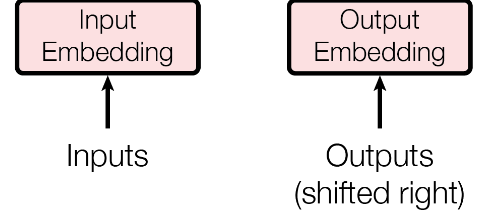
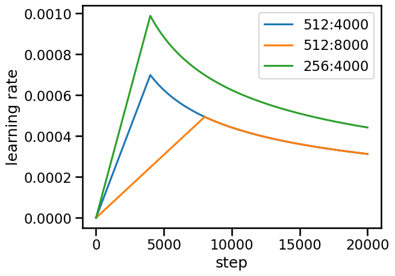
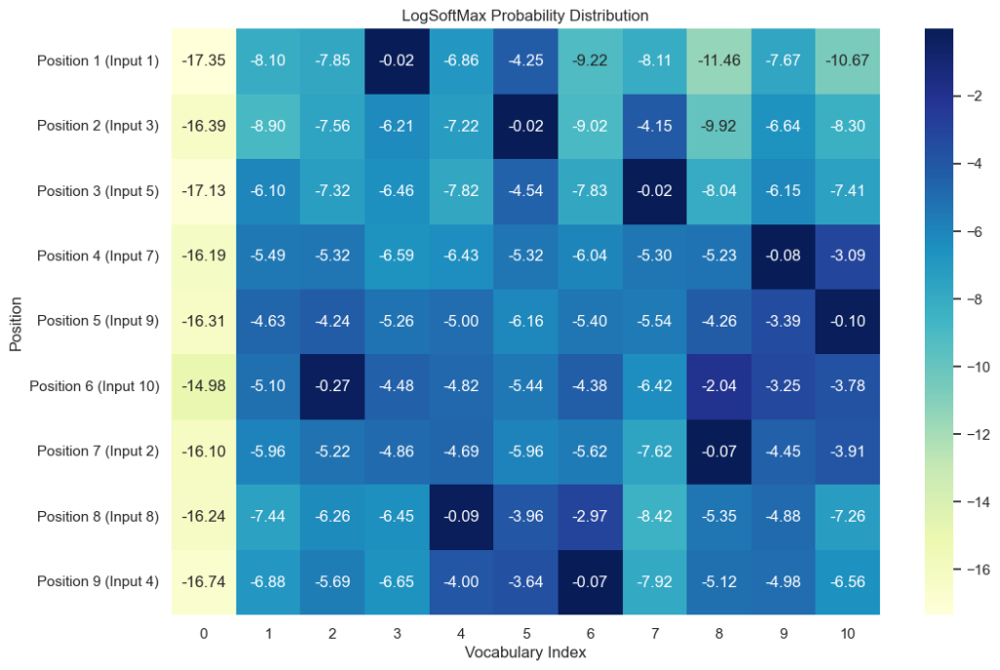
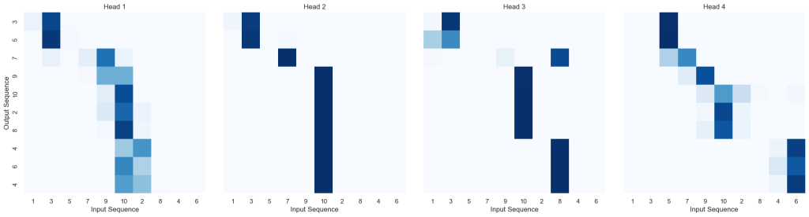
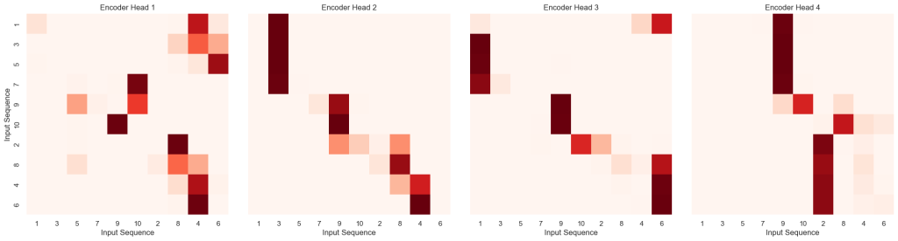

```
"A vast similitude interlocks all."
Your Sincerely
Self-Attention  
```

承接Ep.1文，本文我们继续进一步讲解上一文中构建的模型的实例化（代码需要承接之前的！）

全文阅读时间较长，主要借助网络经典材料加以个人思考解读，如有误欢迎斧正

## 深度学习任务的完整流程

书接上回，我们在构建好Transformer整体模型之后要将其投入使用，然而一个最基本的深度学习任务，一般需要以下这些环节：

Data → Model → Criterion → Loop → Optimizer (Update ↺)

现在我们只是拥有了model模型这个大脑（由Transformer完整架构支持），其他步骤仍需要我们慢慢实现

Notice：Ep.1末尾我们提到，《The Annotated Transformer》原文后续实现的各种工具对于本人初学阶段有些浪费时间/必要性不大，所以以下我们着重于实现原文中所述的"一个简单任务"（**Copy Task**），即复制任务：让机器学会复制我们提供的数字序列，下文即围绕这个任务进行相应的全步骤分析处理准备

5%

## Data：数据生成与封装

我们先来看**Data这个大块**，这一步处理十分重要，而且还可以划分成几个小版块：

**Data Block**

**1\. Generation**  
data\_generator

产生随机数字序列  
确定起始符(BOS)

**2\. Optimization**  
batch\_size\_fn

动态决策 Batch 大小  
防止显存溢出(OOM)

**3\. Processing**  
Batch Class

封装数据生成 Mask  
确定训练目标(target\_y)

① **data\_generator版块：负责产生随机数字序列训练模型**，**是"生产者"**。一般的深度学习任务都会提供相应的数据集用于训练、测试，但由于我们目标任务是Copy Task，故不妨直接**内存生成**是最快、最方便的。

所以在data\_generator板块我们的**Goal**是：随机生成两个完全一样的Tensor张量，分别作为source和target，而且要求第一个符号都是起始符\<BOS\>对应的编码（通常取1）

② **batch\_size\_fn版块：主要是负责动态优化调整每个Batch所含数据量，是"调度者"**。既然每一批（Batch）的句子长度可能不同，它要根据**总 Token 数**而不是**句子条数**来决定这一波给 GPU 喂多少，从而榨干显存又不至于让显卡炸掉（OOM）

所以在batch\_size\_fn版块我们的**Goal**是：该函数的输出一个整数，该整数代表：**为了不让显存爆炸，当前这一批（Batch）最多可以包含多少条数据（样本数）**

当然，在我们的Copy Task任务中由于data\_generator总是输出大小一样的数据，所以这个Dynamic Batching方法在我们这个任务中还没有用武之地

③**Batch版块：主要就是负责封装各个需要的数据**，**是"加工者"**。在模型训练中，我们需要全部数据是：Encoder所用的source、source\_mask；Decoder所用的target、target\_y、target\_mask。其中target是Decoder的输入，而target\_y是正确答案会在Decoder之后计算损失值时使用，target\_mask相当于source\_mask与subsequent\_mask所取的一个并集，作用在target上面用于Decoder预测输出阶段

所以在Batch版块我们的**Goal**是：封装零散的数据，形成一个大的Batch抽象类，然后之后可以直接用这个Batch类进行数据分发

知道了Data版块中各个小板块的功能作用，我们现在对其依次代码实现：

### data_generator：随机序列生成

- **data\_generator模块：**

```
def data_generator(V, batch_size, nbatches):     #V实质是vocab_size即词汇表大小
    for i in range(nbatches):
        #将numpy数组（形状为(batch_size, 10)的随机整数矩阵，每一行从1开始）转换为张量
        data = torch.from_numpy(np.random.randint(1, V, size = (batch_size, 10)))
        
        data[:, 0] = 1   #每一行第一个元素设置为1（表示为BOS起始符的编码）

        data = data.to(device)    #迁移数据（之后可以用GPU训练）

        #由于是Copy Task，所以source和target是相互完全相同的二维张量
        source = Variable(data, requires_grad = False)
        target = Variable(data, requires_grad = False)

        yield Batch(source, target, 0)    #打包生成Batch对象（内部还有掩码操作），pad = 0
```

**三个传入的参数分别表示：词汇表大小为V，一个Batch里面要包含batch\_size条数据，一个Epoch总共需要传入nbatches个Batch的数据量**

于是，用循环遍历的时相当于生成数据是一个Batch一个Batch地生成，所以一共循环nbatches次；由于一个Batch由若干条句子序列组成，所以一个Batch的数据就可以看作是一个数字矩阵，而且是"类独热编码"之后得到的数字矩阵，所以里面的数字取值范围应当为1~(V-1)（注意：Copy Task中每条生成的数据都等长所以不会有PAD = 0编码）；第一个编码设置成1（因为是BOS起始符）

使用yield而非return可节省内存，流水线吐出数据，**最后data\_generator吐出的数据是source和target打包形成的Batch对象**

### batch_size_fn：动态批处理

- 结束了data\_generator，现在我们来快速过一下**第2个Dynamic Batching版块**（在接下来的简单Copy Task中使用不到），即一个**batch\_size\_fn类**：

```
global max_source_in_batch, max_target_in_batch

def batch_size_fn(new, count, sofar):
    global max_source_in_batch, max_target_in_batch
    if count == 1:    
        max_source_in_batch = 0
        max_target_in_batch = 0
    
    #现在的batch记录的数据进行更新'最长纪录'（注意：如果我们的任务是Cpoy Task，那么原文source和译文target会一摸一样）
    max_source_in_batch = max(max_source_in_batch, len(new.source))
    max_target_in_batch = max(max_target_in_batch, len(new.target) + 2)   #'+2':翻译任务中译文需要加入起始符和终止符两个！
    
    #以下计算GPU占用："对齐后的总单词数"（包含那些为了补齐长度而填充的[PAD]）
    source_elements = count * max_source_in_batch
    target_elements = count * max_target_in_batch

    #GPU显存分配的"木桶效应"：模型在训练时，显存消耗取决于"最重"的那一侧（source一段流向Encoder,target一段流向Decoder）
    return max(source_elements, target_elements)
```

回顾一下，之前我们说过，由于输入数据长度不一，长短句混杂会导致大量的 **PAD 填充**。虽然 Mask 能屏蔽这些 PAD 对模型结果的影响，但它们依然会消耗 GPU 算力和显存空间。**Dynamic Batching 的目标是：** 动态调整每个 Batch 里的句子数量（batch\_size），确保每个批次产生的矩阵总面积（batch\_size × 当前批次最大序列长度）维持在一个恒定且接近显存上限的水平。这样可以实现：**短句多塞点，长句少塞点**，从而最大限度减少 Padding 带来的计算浪费，并提升训练效率。

上述代码先定义了**2个全局变量max\_source\_in\_batch, max\_target\_in\_batch分别表示 当前batch中源语言序列（原文）的最大长度 和 当前batch中目标语言序列（译文）的最大长度（含起止符）**。需要这两个变量的原因出于**PAD填充是以填充至矩形为标准，所以这个矩形的长一定由当前batch里面的"最大长度"所决定**  
  
主要的3个参数分别为：**new:准备加入batch的下一个样本对象；count：如果这一条加入，batch里的总句数（正在更新中的batch\_size）；sofar：截至目前已经累计的batch尺寸**（类似于内存）。  
  
我们是把样本数据一个一个扔进去考虑，所以每一波batch的开头会有清零操作：如果是当前batch里面的第1条样本，就把两个全局变量进行重置为0（清空上一个batch留下的'最长纪录'），之后不断更新最大值，**最后返回Encoder与Decoder所用数据占用内存的最大值**。**如果我们预先设置一个内存上限，那么这样能够保证不超越上限又能充分压榨显存**。这样操作之后，**每一个批次的batch\_size都会不同，但是总内存量却保持在一个接近的水平**！

### Batch 类：封装与掩码

- **Batch版块**

```
#Batch对象：把一个batch所需的source、source_mask；target、target_y、target_mask这些数据封装在一块，再把不同数据分别喂给Encoder + Decoder
class Batch:
    def __init__(self, source, target = None, pad = 0):
        self.source = source
        self.source_mask = (source != pad).unsqueeze(-2)

        if target is not None:
            self.target = target[:, :-1]
            self.target_y = target[:, 1:]
            self.target_mask = self.make_std_mask(self.target, pad)
            self.ntokens = (self.target_y != pad).data.sum()
        
    @staticmethod
    def make_std_mask(target, pad):
        target_mask = (target != pad).unsqueeze(-2)     #这一步生成滤去<PAD>的mask
        target_mask = target_mask & Variable(
            subsequent_mask(target.size(-1)).type_as(target_mask.data))

        return target_mask
```

前两个版块我们用data\_generator产出了数据，用batch\_size\_fn知道了打包数据的最大条数，现在就只差Batch类进行封装即可，并且再把Batch类接入到data\_generator里面使用就可以使用数据产出+封装的流程

由于data\_generator中产出的是source和target封装起来的Batch对象，现在的Batch类就是告诉我们这个Batch类收到source和target之后另外构造出一个批次中模型训练所要用到的source\_mask、target\_y、target\_mask，并把这5个数据全部封装起来便于之后把数据分发给Encoder和Decoder

回到data\_generator，产出的source和target是两个完整编码序列，从\<BOS\>代表的1开始一直有10位。我们知道：模型永远预测模型输入的后一位，即Decoder的输入target与正确答案之间具有一步的延后性，故有：

```
            self.target = target[:, :-1]     #target是完整序列去除最后一位
            self.target_y = target[:, 1:]     #target_y是完整序列去除第一位
```

这也是为什么原论文中模型架构图中：



特别标注了对于Decoder的输入进行了 **Shifted Right**的处理

接下来我们来看make\_std\_mask这个函数的构建：

```
    @staticmethod
    def make_std_mask(target, pad):
        target_mask = (target != pad).unsqueeze(-2)
        target_mask = target_mask & Variable(
            subsequent_mask(target.size(-1)).type_as(target_mask.data))
```

@staticmethod 表示把下面这个函数设置为一个**静态函数**，这样这个函数虽然处在Batch这个大类里面，但是传入的参数没有self；而如果没有使用这个方法，那么该函数会被"私有化"，如果要使用这个函数就必须先将Batch类实例化为b，然后才能调用：b.make\_std\_mask( )

注意：在函数静态化之后，这个函数不会与Batch大类进行绑定，也就是给它传入参数target和pad时它只会被动接收这两个参数，并不知道这两个参数是不是Batch里面的成员变量。所以我们在 self.target\_mask 处调用这个函数并传参时用的是处理之后（切掉最后一行）的target，并最终返回一个 **滤PAD（类似于source\_mask）和防偷看的subsequent\_mask的并集**

除了一个批次训练过程中所需的5大数据的封装之外，Batch类新增了一个ntokens，即**算出整个批次里面所有真实标签的总个数**，之后会用于计算每个标签的平均损失值

30%

回顾一下我们最开始提出的整个流程图：

Data ✓ → Model → Criterion → Loop → Optimizer (Update ↺)

我们上述已经完成了Data这一版块，又因为Ep.1中我们已然完成了Model板块的建构：

Data ✓ → Model ✓ → Criterion → Loop → Optimizer (Update ↺)

下面进入损失函数（criterion/loss function）阶段

## Criterion：标签平滑与 KL 散度

- 给出在我们任务中Criterion的计算标准：

```
class LabelSmoothing(nn.Module):
    def __init__(self, vocab_size, padding_idx, smoothing = 0.0):
        super(LabelSmoothing, self).__init__()             #先调用父类的初始化方法
        self.criterion = nn.KLDivLoss(reduction = 'sum')   #实例化KL散度计算损失
        self.padding_idx = padding_idx                     #记录填充符<PAD>的索引
        self.confidence = 1.0 - smoothing   #计算正确答案占据的最高概率（防止模型过拟合，最大信心只有90%）
        self.smoothing =  smoothing         #保存平滑值
        self.vocab_size = vocab_size        #词汇表大小
        self.true_distribution = None       #初始化一个占位符

    def forward(self, x, target):
        assert x.size(1) == self.vocab_size   #检查确保输入的预测结果x（batch_size, vocab_size）的列数（词汇量）和初始化时定义的vocab_size一致
        
        true_distribution = x.data.clone().to(x.device)   #调用tensor对象自带的clone方法，只克隆出数值，是一个新张量，shape:(batch_size, vocab_size)
        true_distribution.fill_(self.smoothing / (self.vocab_size - 2))   #总共vocab_size个词中，扣除正确答案位置和填充符(PAD)位置，还剩下size - 2个坑位平分smoothing值保留微小可能性
        true_distribution.scatter_(1, target.data.unsqueeze(1).to(x.device), self.confidence)   #在刚才铺满微小数值的背景上，找到正确答案的那一列，强行覆盖为0.9（即信心值）
        true_distribution[:, self.padding_idx] = 0   #通过切片操作，将padding_idx（通常是 0）对应的那一整列全部置零（用0标记，之后）
        
        mask = torch.nonzero(target.data == self.padding_idx)   #寻找所有[PAD]的位置，先判断是不是0生成一个Bool矩阵，再用torch.nonzero将True（被认为是1：nonzero）位置索引全部提取出来返回一个坐标列表
        if mask.dim() > 0:   #如果确实存在占位符（该张量维度>0即非空）
            true_distribution.index_fill_(0, mask.squeeze(), 0.0)   #把PAD处的目标分布强行置为0
        
        #将目标分布保存在实例变量中
        self.true_distribution = true_distribution

        #用KL散度公式计算并返回损失值（x：模型的原始输出（预测值），true_distribution是经过平滑之后的目标分布）
        return self.criterion(x, Variable(true_distribution, requires_grad = False))
```

我们知道，Decoder最终的输出应该是一个概率预测分布，而一般而言，这个输出是"非黑即白"的，即：Decoder仅会把其交叉注意力观察到的最大可能性的词汇标识为概率 = 1，而其余词汇在最终的概率分布输出中概率值均 = 0，这会导致一个问题：Decoder处理模糊问题能力较低，模型易过拟合。

解决措施，使用标签平滑化（Label Smoothing），即让模型对于其预测的信心不为100%，而将剩余的信心值均分给其余词汇。这是避免模型过拟合的正则化方法中的一种。

在上述代码中的具体实施：实际思路是我们传入期望设置的超参数smoothing，首先在内存中开辟一块与输出x形状相同的矩阵（batch\_size, vocab\_size），随后先在所有位置上填充一个微小值（由于除去正确答案为confidence和PAD处的0，所以还剩vocab\_size - 2个空，微小值 = smoothing/(vocab\_size - 2)），把正确答案处覆盖成confidence(= 1 - smoothing)，把PAD处覆盖为0，这样就生成了一个"标准答案"的概率分布矩阵（即Target）。

接着我们把这个目标概率分布（P(x)）与经过LogSoftmax之后的输出x(Log Q(x))概率分布代入KL散度公式：

DKL(P∥Q)\=∑P(x)log⁡P(x)Q(x)\=∑P(x)(log⁡P(x)−log⁡Q(x))D_{KL}(P \parallel Q) = \sum P(x) \log \frac{P(x)}{Q(x)} = \sum P(x) (\log P(x) - \log Q(x))

最终散度公式得到的值就表示用预测分布P(x)去表示目标正确分布Q(x)时所得的损失值（信息损失）

数学详情可见：[https://www.countbayesie.com/blog/2017/5/9/kullback-leibler-divergence-explained](https://www.countbayesie.com/blog/2017/5/9/kullback-leibler-divergence-explained)

40%

上述给出了在我们任务中的损失值计算标准，我们知道，**Loop循环阶段肯定是要把当前训练轮次内要做的所有事情全部打包，那么肯定会涉及数据先打包，然后传送给model，model向前传播进行此刻的损失计算和参数更新，最后会有一个类似于日志打印的结果。**

## Optimizer：Noam 学习率调度

- 既然是几个离散的过程拼接在一起，那么我们不妨先来实现里面的一个小步骤：构建一个优化器，其主要作用就是计算梯度、更新权重参数

在Transformer模型中我们使用经典的Adam优化器内核：[https://arxiv.org/abs/1412.6980](https://arxiv.org/abs/1412.6980)

其中Adam的核心公式为：

Update\=一阶矩（方向建议）二阶矩（波动阻力）+ϵ×Learning\_RateUpdate = \frac{一阶矩（方向建议）}{\sqrt{二阶矩（波动阻力）} + \epsilon} \times Learning\_Rate

**分子**：往哪走？（顺着惯性走）  
**分母**：走多快？（波动大的走慢点，波动小的走快点）

虽然Adam优化器可以自适应地调整权重更新的快慢和学习率大小，但是在Transformer训练初期，由于层数过多，导致开始时反向传播得到的梯度过大，而此时的Adam优化器还没有建立好稳定的统计量（二阶矩趋于0）（波动阻力），将会导致参数优化过快

Noam的核心公式是：

lr\=dmodel−0.5⋅min⁡(step−0.5,step⋅warmup−1.5)lr = d_{\text{model}}^{-0.5} \cdot \min(\text{step}^{-0.5}, \text{step} \cdot \text{warmup}^{-1.5})

其中warmup是我们人为设置的热身步数，step是指我们优化到目前进行到了多少步，这样min( )式里面左边随step衰减，右边随step线性递增，取min之后会对学习率learningrate进行限制大小，使学习率像爬山一样：先慢慢爬升（预热），然后再缓缓下降（衰减），并在 step = warmup 的时候取得最大值

整体优化器代码实现如下：

```
class NoamOpt:
    def __init__(self, model_size, factor, warmup, optimizer):
        self.optimizer = optimizer      #被包装的原始优化器（通常是Adam优化器）
        self._step = 0                  #self._step = 0是私有变量风格，记录当前的步数
        self.warmup = warmup            #预热步数
        self.factor = factor            #缩放系数
        self.model_size = model_size    #模型隐层维度：用于根据模型大小缩放学习率：d_model越大，基础学习率就会被压得越低，防止大模型震荡
        self._rate = 0                  #私有变量记录当前学习率数值
    
    def step(self):
        self._step += 1       #计数器+1：步数+1
        rate = self.rate()    #调用rate()函数：根据当前步数算出"这一刻"最合理的学习率

        #PyTorch优化器把参数分成了若干组（param_groups），每组是一个字典，里面存着'lr'学习率数据，现在根据Key修改其对应存储的Value值（强行修改Adam优化器内部的学习率参数值）
        for p in self.optimizer.param_groups:
            p['lr'] = rate
        #内部私有变量用于记录Noam优化器最后一步使用的rate数值
        self._rate = rate

        #调用被包装的原始优化器对象（如 Adam）的step()方法，按照我们修改好的rate学习率数值来修改模型参数（权重）
        self.optimizer.step()
    
    #计算rate的公式，这是Noam的核心公式
    def rate(self, step = None):
        if step is None:
            step = self._step
        #使用factor调节，d_model进行缩放，warmup步数控制热身期，当 step步数 = warmup 时学习率到达最高点，在后期又被抑制减小
        return self.factor * (self.model_size ** (-0.5) * min(step ** (-0.5), step * self.warmup ** (-1.5)))
```

再额外阐释一下Noam调度策略与Adam优化器二者是怎样形成结合体的：

最终每个权重参数更新的步长公式可以这样表示：

最终位移\=RateNoam⏟全局限速×mtvt+ϵ⏟Adam 的个体微调\text{最终位移} = \underbrace{\text{Rate}_{\text{Noam}}}_{\text{全局限速}} \times \underbrace{\frac{m_t}{\sqrt{v_t} + \epsilon}}_{\text{Adam 的个体微调}}

所以Noam修复了Adam起步时候的风险，而Adam在中期则可以根据自身优势自适应地更新模型的各个参数

最终我们建立这样的完整版优化器：

```
#打包得到一个适配于当前模型的完整版优化器（返回得到一个NoamOpt实例）

def get_std_optimizer(model):
    #model.source_embed[0].d_model深入到模型嵌入层读取其维度d_model
    #注：在make_model函数中：nn.Sequential把两个组件打包在了一起，并赋值给了EncoderDecoder类的source_embed参数，进而会有索引0

    return NoamOpt(model.source_embed[0].d_model, 2, 4000, torch.optim.Adam(model.parameters(), lr = 0, betas = (0.9, 0.98), eps = 1e-9))
```

举个简单例子实例化一下：

```
#创建3个不同的NoamOpt实例，用控制变量法对比
optimizers = [NoamOpt(512, 1, 4000, None), 
        NoamOpt(512, 1, 8000, None), 
        NoamOpt(256, 1, 4000, None)]

#对比1、2：仅改变预热步数，会看到曲线的"山峰"向右移动了，且峰值变低了
#对比1、3：仅改变模型维度，会看到维度越小，学习率整体越高

#设定步数范围
steps = np.arange(1, 20000)
```

我们把这三个优化器每一个step处得到的learning rate画出来对比一下：

```
#对于每一个NoamOpt对象，计算它在所有 steps 下的 rate
#生成的y_values是个嵌套列表，其形状为(3, 19999)（3行视为3个不同的NoamOpt实例，19999列视为各个实例下每个step的学习率数据）

y_values = [[optimizer.rate(i) for i in steps] for optimizer in optimizers]
# 绘图时需要将 y_values 转置为(19999, 3)进而与X轴数据steps（一维数组）(19999, )维度相对应，可以进行坐标映射

plt.plot(steps, np.transpose(y_values))
plt.legend(["512:4000", "512:8000", "256:4000"])
plt.xlabel("step")
plt.ylabel("learning rate")
plt.show()
```

最终可视化呈现为：



50%

## Loop：串联训练流程

在我们编写Loop之前，我们先思考一下，**我们一般执行的循环Loop一般来讲跟Optimizer不应该是两个呈先后顺序的步骤**，相反，我们通常希望在Loop里面把模型训练一个Epoch中的所有操作全部囊括，所以，**我们之前虽然独立地解决了Criterion（LabelSmoothing + KL散度） 和 Optimizer（Noam + Adam），我们希望****有一个步骤能够直接调用这两个类，并实现从 "计算Loss ——> 参数更新" 的一个连贯操作**。

### SimpleLossCompute：损失与更新

- **SimpleLossCompute抽象类进行上述这个连贯的操作**

```
#模型的预测、损失计算、反向传播以及参数更新这四个离散的步骤
class SimpleLossCompute:
    def __init__(self, generator, criterion, opt = None):
        #这一步的generator包括: ①线性映射：d_model——>vocab_size ②计算LogSoftmax得到每个词的预测概率值
        self.generator = generator
        self.criterion = criterion   #损失函数
        self.opt = opt               #优化器
    
    #__call__魔法方法：让一个类实例可以像普通函数一样被调用
    def __call__(self, x, y, norm):
        
        x = self.generator(x)   #先通过logits输出通过generator处理得到每个词预测概率
        
        #进入SimpleLossCompute之前，预测输出x(logits)：(batch_size, seq_Len, vocab_size) (三维)；真实标签y：(batch_size, seq_Len)(二维)
        #第一步把两者所有数据压扁对齐：(batch_size*seq_Len, vocab_size)；(batch_size*seq_Len)  （压扁的意义：Transformer是以句子为单位处理，而我们计算损失是以各个词独立计算）

        loss = self.criterion(x.contiguous().view(-1, x.size(-1)), y.contiguous().view(-1)) / norm   
        #除以norm是消除句子长度对loss大小的影响（计算每个Token的均误差）
        loss.backward()   #计算梯度（还未参数优化）

        if self.opt is not None:
            self.opt.step()
            self.opt.optimizer.zero_grad()   #使用新梯度时旧梯度被清零
        
        #梯度更新需要"平均值"，但统计记录需要"总和"
        return loss.item() * norm
```

在上述代码中我们看到SimpleLossCompute的实现思路：首先是计算出预测对数概率分布，将其输入给LabelSmoothing，然后调用criterion计算损失loss并计算出相应梯度，再调用Optimizer进行参数更新优化，最终返回的是这一个Batch的总损失。

等等，为什么首先一步是计算处预测对数概率分布？ 回顾一下，在make\_model的最后一行我们看到：

```
Generator(d_model, target_vocab)
```

而之前我们在定义Generator类的时候有：

```
    def forward(self, x):  #x是decoder的输出，形状为：[batch_size, seq_Len, d_model]
        return F.log_softmax(self.proj(x), dim=-1)
```

这表明Generator类的实例化的forward函数具备输出对数概率分布的功能！

看到这里你更疑惑了，那既然model里面有Generator这一层，那么我们在run\_epoch里面如果调用model的时候应该就会得到对数概率分布啊？那为啥调用model之后还要在SimpleLossCompute里面再算一次？？？

事实上，**run\_epoch里面我们将只调用model.forward( )函数**，而回到EncoderDecoder的forward( )：

```
    #forward函数是模型训练时调用的主函数，主要作用是：训练时形成准确答案语句的memory用于给decoder同步纠错；测试的时候不断调用forward预测下一个词
    def forward(self, source, target, source_mask, target_mask):
        return self.decode(self.encode(source, source_mask), source_mask, target, target_mask)
```

可以看到，**forward函数里面根本不会用到Generator这个大类**，也就是说**在run\_epoch中我们第一步使用model只是调用了它的forward函数，其最终返回的是 Decoder 最后一层输出的特征向量**（Hidden States），形状通常`为（batch_size, seq_Len, d_model），并没有得到最终的对数概率分布！！！`

所以，**我们在SimpleLossCompute中第一步是收到Decoder输出的特征向量之后先使用generator得到对数概率分布输出，再进行后续处理**（送入KL散度公式时PyTorch要求预测分布必须取对数后再传入，目标正确分布则原封不动地传入**）...**

- 补充： **既然model调用forward函数的时候没有用到Generator这个大类，那为什么在make\_model的时候要将Generator这个大类囊括进去？！**

这里暂时地要用到后续实例化优化器时的做法：

```
model_opt = NoamOpt(model.source_embed[0].d_model, 1, 400, \ torch.optim.Adam(model.parameters(), lr = 0, betas = (0.9, 0.998), eps = 1e-9))
```

**实例化优化器的时候我们会传入model.parameters( )，即模型全部的参数**，在SimpleLossCompute中，当我们使用：

```
        loss.backward()
```

会从loss最后一步开始，反向传播，依次经过EncoderDecoder中的所有层，算出其梯度，并进一步使用优化器进行参数优化更新。

现在清晰了：ANS：**在make\_model中我们囊括Generator的大类是为了将其参数包含于model里面，这样model全部参数可以传入优化器，Generator的参数也就顺带传入了优化器，并在后续优化更新的时候参数可以得到更新**。

最后思考一个问题：为什么Generator里面的参数那么重要？为啥要更新它？它的作用是什么?

可以回Ep.1文章复习一下，因为它的作用是 **将Decoder的输出转换为词汇表上的对数概率分布**（Linear + LogSoftMax） ，在run\_epoch里面，我们实际上是**又把它拎出来再作为参数传到run\_epoch**中进行单独的一步处理操作。

60%

解决了计算损失、更新参数离散步骤的打包为SimpleLossCompute，回顾下我们的进度：

Data ✓ → Model ✓ → Criterion ✓ → Loop ... → Optimizer ✓ (Update ↺)

### run_epoch：单轮训练循环

前面说到，Loop阶段的主要工作是首先将封装好的Batch类型数据分发给Encoder与Decoder，然后在创建好的model中向前传播得到预测分布，将预测分布输入criterion算出损失值，最后在optimizer中进行反向传播与参数更新

综上所述，**Loop的主要作用是串联各个打包好的步骤，并组装成一套完整的操作流程**

```
def run_epoch(data_iterator, model, loss_compute):
    start = time.time()
    total_tokens = 0   #一轮epoch中所有batch包含的有效预测单词（Tokens）总数（过滤掉PAD占位符）
    total_loss = 0   #当前epoch中所有batch样本产生的损失总和
    tokens = 0

    for i, batch in enumerate(data_iterator):
        #调用forward函数计算得到模型最终的输出out：是一张巨大的概率分布表，每一行数据表示依次预测序列中每一个词时词汇表中每个词的概率得分
        out = model.forward(batch.source, batch.target, batch.source_mask, batch.target_mask)

        #计算损失并累加到total_loss中，计算得整个batch的所有Loss之和
        loss = loss_compute(out, batch.target_y, batch.ntokens)
        total_loss += loss
        
        #累加得
        total_tokens += batch.ntokens
        tokens += batch.ntokens
        
        #每50个batch打印一次日志
        if i % 50 == 1:
            elapsed = time.time() - start   #处理刚才的50个batch所用的时长
            #'loss/batch.ntokens' 是模型当前这个batch的平均损失值
            print("Epoch Step: %d Loss: %f Tokens per Second: %f" % (i, loss/batch.ntokens, tokens/elapsed))
            start = time.time()
            tokens = 0
        
        #在这一轮epoch所有batch被处理完成之后返回的这一整轮（Epoch）的平均损失水平
    return total_loss / total_tokens
```

我们看到在核心for循环中我们先根据单独拎出来传入的generator实例得到模型的预测概率分布输出out，随即计算损失loss，然后根据每个batch里面的ntokens数计算并打印日志：一轮Batch中的平均损失值。

这就是run\_epoch要做的所有事情。

65%

## 训练模型

讲了这么久，进度拉满！

Data ✓ → Model ✓ → Criterion ✓ → Loop ✓ → Optimizer ✓ (Update ↺)

相信如果看到这里的诸位已经磨刀霍霍了，话不多说，模型先来跑一跑：

```
device = torch.device("cuda" if torch.cuda.is_available else "cpu")
print(device)
```

如果输出cuda说明GPU配置好了，用它跑这个训练快一些，没有的话只用CPU也不要紧

```
#建立一个Copy Task的模型，先进行训练
V = 11   #词汇表大小
criterion = LabelSmoothing(vocab_size = V, padding_idx = 0, smoothing = 0.0)
model = make_model(V, V, N=2)

#如果执行过print(device)显示你已经配好了cuda，那么就会迁移至GPU
model.to(device)
criterion.to(device)

model_opt = NoamOpt(model.source_embed[0].d_model, 1, 400, torch.optim.Adam(model.parameters(), lr = 0, betas = (0.9, 0.998), eps = 1e-9))

for epoch in range(15):      #epoch不要设置太大了，到后面损失反而会变大
    model.train()
    run_epoch(data_generator(V, 30, 20), model, SimpleLossCompute(model.generator, criterion, model_opt))
    model.eval()
    print(run_epoch(data_generator(V, 30, 5), model, SimpleLossCompute(model.generator, criterion, None)))
```

执行后会输出日志，输出样例：

```
Epoch Step: 1 Loss: 2.917849 Tokens per Second: 1117.338867
Epoch Step: 1 Loss: 1.903459 Tokens per Second: 11235.077148
tensor(1.8871, device='cuda:0')
......
```

## 贪心解码与推理

大概30s跑完模型训练之后，我们期望用我们训练的模型做一个交互式程序，看看能否正确完成Copy Task。现在的情形是：我们手上有完整的Transformer模型架构，也有一套它训练了30个Epoch后得到的一套权重参数，而我们的期望是我们自己设定一个seq\_Len = 10 （因为我们之前训练时设置的V = 11，里面还包含\<PAD\> = 0）的数字序列为输入，让模型能够完成这个Copy Task

我们知道，在SimpleLossCompute中我们第一步的操作是根据Decoder输出的特征向量得到了模型的对数概率预测分布，随后我们再将这个概率分布与真实分布对比得到损失。而在现在的任务中，模型需要预测得到这个真实分布。

自然地，我们可以认定模型输出的就是真实分布，这就是模型最终的预测结果。

由于generator处理（batch\_size, seq\_Len, d\_model）得到的是一个概率分布（batch\_size, seq\_Len, vocab\_size），准确来讲这算是一个二维矩阵，因为我们预测任务中给模型的输入只有一个，所以batch\_size = 1。假设我们规定生成的序列最大长度为10，这个矩阵大概长成（这个地方我乱画的）：

Sequence Generation Probability Matrix

| Idx Position | 0 (EOS) | 1 | 2 | 3 | 4 | 5 | 6 | 7 | 8 | 9 | 10 |
| --- | --- | --- | --- | --- | --- | --- | --- | --- | --- | --- | --- |
| 1 | \-8.42 | \-5.88 | \-7.10 | \-6.34 | \-6.15 | \-0.02 | \-6.78 | \-7.21 | \-6.95 | \-7.05 | \-6.34 |
| 2 | \-7.51 | \-4.32 | \-0.35 | \-4.12 | \-4.55 | \-4.28 | \-4.66 | \-4.38 | \-4.47 | \-4.19 | \-4.41 |
| 3 | \-9.88 | \-6.56 | \-7.12 | \-6.98 | \-7.21 | \-6.77 | \-7.01 | \-6.95 | \-6.92 | \-0.01 | \-6.82 |
| 4 | \-8.21 | \-0.09 | \-5.42 | \-5.05 | \-5.18 | \-5.32 | \-5.25 | \-5.38 | \-5.10 | \-5.24 | \-5.14 |
| 5 | \-7.34 | \-5.12 | \-5.67 | \-5.28 | \-5.45 | \-5.20 | \-5.51 | \-5.62 | \-0.07 | \-5.48 | \-5.38 |
| 6 | \-6.21 | \-3.05 | \-3.45 | \-3.32 | \-0.65 | \-3.11 | \-3.28 | \-3.52 | \-3.15 | \-3.25 | \-3.19 |
| 7 | \-8.05 | \-5.67 | \-5.92 | \-5.75 | \-5.82 | \-5.70 | \-5.95 | \-0.15 | \-5.96 | \-5.90 | \-5.85 |
| 8 | \-7.77 | \-4.55 | \-4.82 | \-0.12 | \-4.58 | \-4.62 | \-4.85 | \-4.92 | \-4.71 | \-4.80 | \-4.74 |
| 9 | \-9.12 | \-4.98 | \-5.25 | \-5.05 | \-5.18 | \-5.01 | \-0.04 | \-5.32 | \-5.11 | \-5.21 | \-5.15 |
| 10 | \-0.03 | \-6.12 | \-6.54 | \-6.32 | \-6.48 | \-6.25 | \-6.61 | \-6.70 | \-6.42 | \-6.52 | \-6.38 |

其中绿色荧光部分就是模型在当前位置认为最有可能的输出（对数概率值最大）

那么我们可以使用一种"贪心解码"的方式，让模型在每一步都取概率最大的数字即可：

```
def greedy_decode(model, source, source_mask, max_Len, start_symbol):   
                                                 #source是输入序列，max_Len是最大生成长度（BOS要计入个数，手动设置以限制否则模型生成不会停止），start_symbol是起始符

    memory = model.encode(source, source_mask)   #首先经过encoder得到memory（'含义矩阵'）以便后续给decoder使用

    #初始化输出张量yield_sequence(1*1，元素是1，表示第一个位置永远是起始符BOS)：先创建，再用fill_修改原张量的值为start_symbol的值（一般就是1），最后将其与source同步（之前我们迁移source至GPU，而张量默认存储在CPU上，无法跨设备进行矩阵计算）
    yield_sequence = torch.ones(1, 1).fill_(start_symbol).type_as(source.data)

    #循环每进行一次，便会往后生成一个词
    for i in range(max_Len - 1):
        #得到的out: (batch_size, current_Len, d_model)
        out = model.decode(memory, source_mask, Variable(yield_sequence),\
Variable(subsequent_mask(yield_sequence.size(1)).type_as(source.data)))
        
        #generator是在之前的Generator里定义，作用是将decoder的输出转换为词汇表上的概率分布，out[:,-1]切片得到对于下一个词的预测
        prob = model.generator(out[:, -1])    #prob：(batch_size,V)
        
        #我们只需要得到返回的最大值索引并赋值给next_word（dim = 1意味着横向比较，即当前预测处词汇表中词与词之间概率值进行比较）
        _, next_word = torch.max(prob, dim = 1)
        next_word = next_word.item()

        #torch.cat将索引值横向拼接成一个完整序列
        yield_sequence = torch.cat([yield_sequence, torch.ones(1, 1).type_as(source.data).fill_(next_word)], dim = 1)

    return yield_sequence
```

78%

现在模型和解码器逻辑都已经准备就绪，现在手动初始化一个source序列，然后让model跑一遍

```
#把之前我们训练好的模型调至评测状态，进行测试输出
model.eval()
source = Variable(torch.LongTensor([[1,3,5,7,9,10,2,8,4,6]])).to(device)
source_mask = Variable(torch.ones(1, 1, 10)).to(device)
print(greedy_decode(model, source, source_mask, max_Len = 10, start_symbol = 1))
```

得到输出：

```
tensor([[ 1,  3,  5,  7,  9, 10,  2,  8,  4,  6]], device='cuda:0')
```

80%

我们现在其实可以来看一下模型这一步是怎么预测出这个序列的，我们可以把generator处理后的概率分布调出来看一下：

```
model.eval()
with torch.no_grad():         #声明：不计算梯度
    memory = model.encode(source, source_mask)
    yielded_sequence = torch.ones(1, 1).fill_(1).type_as(source.data) 
    
    all_step_probs = []

    #模拟之前的那个循环过程，但额外将prob存入一个列表
    for i in range(9):        #9 = max_Len - 1
        out = model.decode(memory, source_mask, yielded_sequence, 
                           subsequent_mask(yielded_sequence.size(1)).type_as(source.data))
        
        prob = model.generator(out[:, -1])            #核心一步：获取LogSoftmax后的概率分布
        
        all_step_probs.append(prob.cpu().numpy())     #把得到的对数值加入到一个空列表中
        
        #更新yielded_sequence以便下一步迭代
        _, next_word = torch.max(prob, dim=1)
        yielded_sequence = torch.cat([yielded_sequence, torch.ones(1, 1).type_as(source.data).fill_(next_word.item())], dim=1)

#把得到的all_step_probs列表纵向堆叠形成矩阵，shape：（steps, vocab_size）
prob_matrix = np.concatenate(all_step_probs, axis=0)

#下面开始绘图
plt.figure(figsize=(12, 8))
seaborn.heatmap(prob_matrix, annot=True, fmt=".2f", cmap="YlGnBu", 
            xticklabels=range(prob_matrix.shape[1]), 
            yticklabels=[f"Position {i+1} (Input {int(yielded_sequence[0,i])})" for i in range(9)])

plt.title("LogSoftMax Probability Distribution")
plt.xlabel("Vocabulary Index")
plt.ylabel("Position")
plt.show()
```

虽然在上述过程中我们实际画图并不会用到yielded\_sequence，但由于循环只有在上一个确定的答案后继续进行，所以里面有在不断延长yielded\_sequence

最后对应的图像为：



图中每一行深色的地方就是模型在每一步的预测输出

85%

## 注意力可视化

最后我们来实现注意力可视化：

### 交叉注意力可视化

- **交叉注意力可视化**

```
seaborn.set_theme(style = "white")

def visualize_attention(model, source_sent, start_symbol = 1):
    model.eval()
    source = torch.LongTensor([source_sent]).to(device)
    source_mask = torch.ones(1, 1, len(source_sent)).to(device)

    max_Len = len(source_sent) + 1
    #需要运行greedy_decode，因为交叉注意力的本质是Decoder拿着Q去问Encoder要K（Q与K再转置乘积得到注意力权重矩阵）
    decoded = greedy_decode(model, source, source_mask, max_Len = max_Len, start_symbol = 1)

    input_labels = [str(x) for x in source_sent]
    output_labels = [str(decoded[0, i].item()) for i in range(1, decoded.size(1))]

    #关键一步！
    attention_data = model.decoder.layers[1].cross_attention.attention[0].detach().cpu().numpy()

    fig, axs = plt.subplots(1, 4, figsize = (20, 5))

    for h in range(4):      #4个Head
        #提取当前头的数据，并截取到实际生成的长度
        data = attention_data[h][:len(output_labels), :len(input_labels)]
        
        #绘图
        seaborn.heatmap(data, 
                    xticklabels=input_labels, 
                    yticklabels=output_labels if h == 0 else [], 
                    square=True, vmin=0.0, vmax=1.0, 
                    cbar=False, ax=axs[h], cmap="Blues")
        axs[h].set_title(f"Head {h+1}")
        axs[h].set_xlabel("Input Sequence")
        if h == 0:
            axs[h].set_ylabel("Output Sequence")

    plt.tight_layout()
    plt.show()

#执行可视化
#使用传入的source相同序列
test_sent = [1, 3, 5, 7, 9, 10, 2, 8, 4, 6]
visualize_attention(model, test_sent)
```



上面中这行代码是关键：

```
attention_data = model.decoder.layers[1].cross_attention.attention[0].detach().cpu().numpy()
```

表示深入到decoder的第一个字曾中的cross\_attention小块中取出其attention权重矩阵的第1个样本，也就是4个头对于输入这条句子每个位置预测值的观测位置

由于：

Attention\=Softmax(QKTdk)Attention = \text{Softmax}\left(\frac{QK^T}{\sqrt{d_k}}\right)

所以 Attention矩阵的形状为：

(Batch\_Size,Heads,Query\_Len,Key\_Len)(Batch\_Size, Heads, Query\_Len, Key\_Len)

在Copy Task中 Query\_Len = source\_Len = "seq\_Len" = target\_Len = Key\_Len （此题中是10）

在预测时batch\_size = 1，但还是需要一个索引\[0\]把四个Head的所有观测数据全部取出来，之后再在这一步再用一个索引分别取4个Head的数据：

```
data = attention_data[h][:len(output_labels), :len(input_labels)]
```

92%

### Encoder 自注意力可视化

- **Encoder中的自注意力可视化**：

```
#自注意力可视化：即查看输入序列内部各词之间的关系
def visualize_encoder_self_attention(model, source_sent):

    model.eval()

    source = torch.LongTensor([source_sent]).to(device)
    source_mask = torch.ones(1, 1, len(source_sent)).to(device)

    #只需要运行 encoder 部分 (不需要 greedy_decode，因为这是自注意力)
    #我们触发一次 forward 或者直接调用 encode 来捕获注意力矩阵
    with torch.no_grad():
        model.encode(source, source_mask)

    #提取 Encoder 的注意力数据
    #注意：这里路径改为 .self_attention，通常取最后一层 (N-1) 的效果最明显
    attention_data = model.encoder.layers[1].self_attention.attention[0].detach().cpu().numpy()

    #准备标签 (横纵轴相同)
    labels = [str(x) for x in source_sent]

    #绘图
    fig, axs = plt.subplots(1, 4, figsize=(20, 5))
    
    for h in range(4):
        data = attention_data[h]        #(seq_len, seq_len)
        
        seaborn.heatmap(data, 
                        xticklabels=labels, 
                        yticklabels=labels if h == 0 else [], 
                        square=True, vmin=0.0, vmax=1.0, 
                        cbar=False, ax=axs[h], cmap="Reds") 
        
        axs[h].set_title(f"Encoder Head {h+1}")
        axs[h].set_xlabel("Input Sequence")
        if h == 0:
            axs[h].set_ylabel("Input Sequence")

    plt.tight_layout()
    plt.show()

text_sent = [1, 3, 5, 7, 9, 10, 2, 8, 4, 6]
visualize_encoder_self_attention(model, test_sent)
```



自注意力可视化与交叉注意力可视化大同小异：  
①不需要运行greedy\_decode因为我们此处只是可视化Encoder的自注意力，不涉及Decoder  
②自注意力访问Encoder里面的self\_attention；交叉注意力访问的是Decoder里面的cross\_attention

进一步地，可以简单解释一下上述两幅可视化热力图的具体含义：

- 交叉注意力图： **纵轴（Output Sequence）**：代表"正在生成的词"。每一行代表模型在生成第i个数字时的状态。**横轴（Input Sequence）**：代表"原文中的词"。每一列代表输入序列中的第 j个数字。  
    热力图的一行，描述了模型为了写出当前这个输出词，分别从原文的各个位置"搬运"了多少信息。深色表示"强关联"

- 自注意力图：**纵轴（Input Sequence）**：代表序列中的**每一个词**（作为查询者 Query），横轴（Input Sequence）代表序列中的**每一个词**（作为被查询者 Key），**由于是自注意力**，纵轴和横轴的标签完全一样。纵轴（Query）在观察横轴（Key），所以可以先锁定一个y坐标，表示"正站在y的视角进行观察"

99.9%

## 结语

到此为止，基础的Transformer模型架构及一个简单的Copy Task实现已经完全结束！

更多资料可参考如下（不全）（在本文中虽并未参考，但读者可另行翻阅）：

① [https://medium.com/@mayanksultania/transformers-101-tokens-attention-and-beyond-b080a900ca6c](https://medium.com/@mayanksultania/transformers-101-tokens-attention-and-beyond-b080a900ca6c)  
② [https://jalammar.github.io/illustrated-transformer/](https://jalammar.github.io/illustrated-transformer/)  
③ [https://www.ruder.io/optimizing-gradient-descent/](https://www.ruder.io/optimizing-gradient-descent/)

2026.3.4晚